<!-- ola -->

# SISTEMAS DE GESTIÓN DE INVENTARIOS Y VENTAS

Jean Karlo Velassquez Pachon

Tecnologías del Futuro S.A.S.

SERVICIO NACIONAL DE APRENDIZAJE (SENA)

[Centro de formación]

Tecnólogo en Análisis y Desarrollo de Software

Fase: Análisis

Formación: Tecnólogo

Fecha de entrega: [dd/mm/aaaa]

---

# FICHA DEL DOCUMENTO

**Fecha de creación, seguido de cada intervención**

| FECHA | REVISIÓN(ES) | AUTOR(ES) |
|:---:|:---:|:---:|
| 2026-08-20 | 1 | Jean Karlo Velassquez Pachon |
| | | |

**DOCUMENTO VALIDADO POR LAS PARTES EN FECHA: ---------**

*(partes involucradas, puede ser una o varias)*

| POR CLIENTE | DESARROLLADOR |
|:---:|:---:|
| FECHA: | FECHA: |
| NOMBRE DEL ENCARGADO | NOMBRE DEL ENCARGADO |

---

# FICHA DEL DOCUMENTO

## CONTENIDO

1. INTRODUCCION
   1.1. OBJETIVO GENERAL  
   1.2. OBJETIVOS ESPECIFICOS  
   1.3. PROPOSITO  
   1.4. ALCANCE  
   1.5. PERSONAL INVOLUCRADO  
   1.6. DEFINICIONES, ACRONIMOS Y ABREVIATURAS  
   1.7. REFERENCIAS  
   1.8. RESUMEN  

2. DESCRIPCION GENERAL  
   2.1. PERSPECTIVA DEL PRODUCTO  
   2.2. FUNCIONALIDADES DEL PRODUCTO  
   2.3. CARACTERISTICAS DE LOS USUARIOS  
   2.4. RESTRICCIONES  

3. REQUISITOS ESPECIFICOS  
   3.1. REQUISITOS DEL SISTEMA  
   3.2. REQUISITOS FUNCIONALES  
   3.3. REQUISITOS NO FUNCIONALES  

4. VALIDACIÓN DE REQUISITOS  
   4.1. CONSTRUCCIÓN DE PROTOTIPOS  
   4.2. FORMATO DE CASO DE PRUEBA  
   4.3. CRONOGRAMA DE ACTIVIDADES

---

# 1. INTRODUCCION

El presente documento describe el análisis y especificación de requisitos del sistema **"Sistemas de gestión de inventarios y ventas"**, desarrollado para la empresa **Tecnologías del Futuro S.A.S.** La empresa presenta dificultades para controlar su inventario, registrar ventas, gestionar clientes y proveedores, y generar reportes confiables. Actualmente se usan procesos manuales o herramientas ofimáticas aisladas, lo que genera pérdidas por desabastecimiento, errores en facturación y demoras en la atención.

El sistema propuesto centraliza la operación comercial mediante módulos de productos, inventario, ventas, clientes, proveedores, reportes y configuración, con control de acceso por roles (Administrador, Vendedor, Consultor). Con ello se busca mejorar la eficiencia operativa, reducir errores y facilitar la toma de decisiones.

## 1.1. OBJETIVO GENERAL

Desarrollar un sistema de información que permita gestionar de manera integral el inventario, las ventas, los clientes y los proveedores de **Tecnologías del Futuro S.A.S.**, optimizando los procesos operativos y facilitando la toma de decisiones mediante reportes confiables y en tiempo real.

## 1.2. OBJETIVOS ESPECIFICOS

- Implementar un módulo de autenticación y control de acceso por roles.
- Gestionar el catálogo de productos con categorías, precios, stock mínimo y stock máximo.
- Automatizar el registro de ventas, cálculo de subtotal, impuestos, descuentos y generación de comprobantes.
- Administrar la información de clientes y proveedores con historial de operaciones.
- Permitir la consulta de inventario en tiempo real.
- Generar reportes de ventas, inventario, clientes y proveedores, exportables en PDF y Excel.
- Configurar parámetros generales del sistema (impuestos, políticas de inventario, seguridad).
- Garantizar la seguridad, auditoría y trazabilidad de los cambios realizados.

## 1.3. PROPOSITO

El software tiene como finalidad centralizar la operación comercial de **Tecnologías del Futuro S.A.S.**, eliminando registros manuales y dispersos, reduciendo errores humanos y proporcionando información oportuna para la reposición de inventario, la gestión de cartera y la toma de decisiones gerenciales.

## 1.4. ALCANCE

El sistema abarcará los siguientes procesos:

- Gestión de productos, categorías y proveedores.
- Registro y consulta de inventario (stock, movimientos, stock mínimo).
- Registro de ventas con cálculo de subtotal, IVA, descuentos y generación de factura.
- Gestión de clientes (personas naturales y jurídicas) con historial de compras.
- Generación de reportes operativos y de análisis.
- Configuración de parámetros generales del sistema.
- Control de acceso por roles (Administrador, Vendedor, Consultor).

**No incluye** en esta versión: facturación electrónica ante la DIAN, integración con pasarelas de pago, comercio electrónico, aplicación móvil nativa, ni integración con sistemas contables externos.

## 1.5. PERSONAL INVOLUCRADO

| NOMBRE | ROL | PROFESION | RESPONSABILIDADES | INFORMACION DE CONTACTO | APRUEBA |
|---|---|---|---|---|---|
| Jean Karlo Velassquez Pachon | Líder Técnico / Analista | Ingeniero de Sistemas | Dirección del proyecto, modelado UML, especificación de requisitos | jvelassquez@tecnologiasdelfuturo.com | SI |
| [Por definir] | Analista | Ingeniero de Sistemas | Levantamiento de información, modelado, validación | [correo] | NO |
| [Por definir] | Desarrollador | Ingeniero de Sistemas | Implementación del sistema, pruebas | [correo] | NO |
| [Por definir] | Cliente / Usuario | Administrador | Validación de requisitos y aceptación | [correo] | SI |

*(Aprueba entrevista y seguimiento)*

## 1.6. DEFINICIONES, ACRONIMOS Y ABREVIATURAS

| Término | Definición |
|---|---|
| SENA | Servicio Nacional de Aprendizaje |
| UML | Lenguaje Unificado de Modelado |
| RF | Requisito Funcional |
| RNF | Requisito No Funcional |
| IVA | Impuesto sobre el Valor Añadido |
| PDF | Portable Document Format |
| Excel | Hoja de cálculo electrónica |
| CRUD | Crear, Leer, Actualizar, Eliminar |
| Stock | Cantidad de productos disponibles en inventario |
| Login | Inicio de sesión |
| BD | Base de datos |

## 1.7. REFERENCIAS

- **Sistemas similares:** SAP Business One, Odoo Inventario, Factusol, Siigo, Alegra, Zoho Inventory.
- **Normas y metodologías:** ISO/IEC 25010 (calidad de software), Scrum, RUP, UML 2.5.
- **Documentación del proyecto:** Casos de uso, diagramas de actividades, diagrama de clases y cronograma de análisis.

## 1.8. RESUMEN

El sistema **"Sistemas de gestión de inventarios y ventas"** permitirá a **Tecnologías del Futuro S.A.S.** administrar productos, inventario, ventas, clientes y proveedores desde una aplicación web con roles diferenciados. El Administrador tendrá control total; el Vendedor podrá registrar ventas y gestionar clientes; el Consultor solo podrá consultar información y generar reportes. Con ello se espera reducir errores, mejorar los tiempos de atención y contar con información confiable para la toma de decisiones.

---

# 2. DESCRIPCION GENERAL

El sistema funciona como una aplicación web accesible desde un navegador. El usuario inicia sesión según su rol y accede a un panel con los módulos habilitados. La información se almacena en una base de datos centralizada. El sistema valida stock, calcula totales, genera comprobantes y actualiza el inventario automáticamente.

## 2.1. PERSPECTIVA DEL PRODUCTO

El sistema se describe como una interfaz web con las siguientes características:

- **Usuarios y roles:** Administrador, Vendedor y Consultor.
- **Interacción:** El usuario interactúa mediante formularios, tablas, filtros, botones y menús.
- **Módulos:** Login, productos, inventario, ventas, clientes, proveedores, reportes y configuración.
- **Flujo principal:** El Vendedor registra una venta; el sistema verifica stock, calcula totales, genera factura y descuenta inventario. El Administrador gestiona catálogos y configuración. El Consultor visualiza reportes.
- **Integración:** Base de datos relacional; exportación a PDF y Excel.

## 2.2. FUNCIONALIDADES DEL PRODUCTO

> El siguiente cuestionario de elicitación de requisitos contiene 120 preguntas estructuradas en 8 categorías, presentadas en formato de opción múltiple con casillas de verificación para marcar. Su propósito es levantar la información clave con los interesados, clientes y equipo técnico para definir con precisión las necesidades, restricciones y capacidades que debe cumplir el software a desarrollar.

---

### Categoría 1: Visión del Producto y Objetivos del Edificio (Preguntas 1-15)

**1. ¿Cuál es el tipo de inmueble principal al que va dirigido el software?** *(Respuesta Única)*

- [x] Edificio residencial de apartamentos.
- [ ] Conjunto residencial cerrado (Casas).
- [ ] Edificio de oficinas o uso corporativo.
- [ ] Centro comercial o uso mixto.
- [ ] Otro (Especifique): _________

---

**2. ¿Cuál es el objetivo prioritario que busca la administración?** *(Respuesta Única)*

- [ ] Optimizar la cobranza y reducir la morosidad.
- [ ] Mejorar la seguridad y el control de acceso.
- [ ] Automatizar la gestión de mantenimiento y zonas comunes.
- [ ] Fortalecer la comunicación y transparencia con los propietarios.
- [x] Todas las anteriores.

---

**3. ¿Quiénes serán los usuarios activos directos del sistema?** *(Respuesta Múltiple)*

- [x] Residentes / Propietarios.
- [x] Arrendatarios / Inquilinos.
- [x] Personal de portería / Seguridad.
- [x] Personal administrativo / Gerencia de la copropiedad.
- [ ] Todos los anteriores.

---

**4. ¿Cómo se estructurará el modelo de cobranza o adquisición de la plataforma?** *(Respuesta Única)*

- [x] Suscripción mensual por edificio (tarifa fija).
- [ ] Cobro por unidad residencial (apartamento).
- [ ] Pago único por licencia perpetua.
- [ ] Modelo Freemium (básico gratuito, funciones avanzadas de pago).
- [ ] Otro (Especifique): _________

---

**5. ¿Qué nivel de adopción tecnológica se espera de los residentes?** *(Respuesta Única)*

- [ ] Bajo (Usan principalmente herramientas analógicas o llamadas telefónicas).
- [ ] Medio (Usan WhatsApp y correo electrónico, pero no Apps complejas).
- [x] Alto (Usan Apps bancarias, redes sociales y están familiarizados con la tecnología).
- [ ] Mixto (Combinación de todos los niveles).

---

**6. ¿El software gestionará una sola copropiedad o múltiples conjuntos (Multi-edificio)?** *(Respuesta Única)*

- [x] Una sola copropiedad (edificio único).
- [ ] Múltiples copropiedades (conjuntos o sedes diferentes).
- [ ] No está definido aún.

---

**7. ¿A qué sistema actual reemplazará esta solución en la copropiedad?** *(Respuesta Única)*

- [ ] Sistema de escritorio en Excel / Access.
- [ ] Software heredado de otra empresa (especifique): _________
- [x] Proceso manual en papel o libretas de portería.
- [ ] No reemplaza a ningún sistema (es el primero).
- [ ] Otro (Especifique): _________

---

**8. ¿Cuál es la mayor pérdida financiera u operativa que se busca erradicar?** *(Respuesta Única)*

- [ ] Morosidad en el pago de cuotas de administración.
- [ ] Robo o hurto en zonas comunes o apartamentos.
- [x] Tiempo perdido en procesos manuales de portería.
- [ ] Conflictos entre vecinos por uso de zonas comunes.
- [ ] Desconocimiento del estado financiero de la copropiedad.

---

**9. ¿Cuál es la tolerancia al tiempo de inactividad (Downtime) en portería?** *(Respuesta Única)*

- [x] Cero tolerancia, debe funcionar 24/7 sin interrupciones.
- [ ] Máximo 1 hora al mes para mantenimiento programado.
- [ ] Puede fallar ocasionalmente, se resuelve manualmente.
- [ ] Solo debe funcionar en horario laboral (7 am - 7 pm).

---

**10. ¿Cómo se manejarán las quejas, reclamos y peticiones (PQRS) de los copropietarios?** *(Respuesta Única)*

- [x] Digitales a través de la App.
- [ ] Físicas en un formato en portería que luego se digitaliza.
- [ ] Mixto (Ambos canales: digital y físico).
- [ ] No se contempla un módulo específico para PQRS.

---

**11. ¿El sistema contempla la organización de Asambleas de Copropietarios?** *(Respuesta Única)*

- [x] Sí, con convocatorias, quórum, votaciones y actas.
- [ ] Sí, solo para registro de convocatorias y asistencia.
- [ ] No, se maneja externamente.
- [ ] Opcional, como módulo adicional.

---

**12. ¿Qué rol jugará la Junta de Administración / Consejo de Copropiedad?** *(Respuesta Única)*

- [ ] Solo consulta de información.
- [ ] Aprobación de gastos y validación de actas.
- [ ] Acceso completo a todos los módulos financieros.
- [x] A y B.
- [ ] Ninguno de los anteriores.

---

**13. ¿Se requiere un módulo para la gestión de arrendamientos?** *(Respuesta Única)*

- [ ] Sí, para gestionar contratos de arrendamiento y cobro de cánones.
- [x] Sí, solo para registrar inquilinos.
- [ ] No, el arrendatario es considerado como un residente más.
- [ ] No está definido aún.

---

**14. ¿Cuál es la escala inicial de unidades residenciales/comerciales a soportar?** *(Respuesta Única)*

- [ ] Menos de 20 unidades.
- [ ] Entre 20 y 50 unidades.
- [x] Entre 50 y 100 unidades.
- [ ] Más de 100 unidades.
- [ ] No se ha definido.

---

**15. ¿Cómo se medirá el éxito de la implementación del software en el edificio?** *(Respuesta Múltiple)*

- [x] Reducción del índice de morosidad.
- [x] Mejora en la satisfacción de los residentes (encuestas).
- [x] Disminución en el tiempo de respuesta a incidentes.
- [ ] Aumento en el uso de zonas comunes.
- [ ] Todas las anteriores.

---

### Categoría 2: Arquitectura del Sistema e Integración de Hardware (Preguntas 16-30)

**16. ¿Qué entorno técnico operará en la recepción/portería del edificio?** *(Respuesta Única)*

- [ ] Computador de escritorio (Windows/Linux).
- [x] Tablet (Android/iOS).
- [ ] Pantalla táctil dedicada (Totem).
- [ ] Múltiples dispositivos (Computador + Tablet + Teléfono IP).
- [ ] Otro (Especifique): _________

---

**17. ¿Cómo interactuará el software con las barreras/portones vehiculares?** *(Respuesta Única)*

- [ ] Apertura mediante control remoto genérico (RF).
- [ ] Apertura mediante señal eléctrica desde el software (relé).
- [ ] Apertura mediante reconocimiento de placa (LPR - Lectura de placas).
- [x] B y C combinados.
- [ ] Sin integración directa.

---

**18. ¿Qué tecnología se utilizará para el control de acceso peatonal?** *(Respuesta Múltiple)*

- [x] Código QR dinámico (generado en la App del residente).
- [x] Tarjeta de proximidad (RFID / NFC).
- [x] Biometría (Huella / Reconocimiento facial).
- [ ] Marcación manual desde el software de portería.
- [ ] Todas las anteriores.

---

**19. ¿Cómo funcionará la citofonía (intercomunicación) entre portería y apartamentos?** *(Respuesta Única)*

- [x] A través de llamada VoIP integrada en la App y Tablet de portería.
- [ ] Por medio del sistema de citofonía tradicional (cableado), sin integración.
- [ ] Combinación de A y B (híbrido).
- [ ] A través de llamada telefónica a número fijo del apartamento.

---

**20. ¿Qué arquitectura de backend respaldará la operación del software?** *(Respuesta Única)*

- [x] Nube pública (AWS, GCP, Azure).
- [ ] Servidor local (On-premise) dentro del edificio.
- [ ] Nube privada o híbrida.
- [ ] Sin definir aún.

---

**21. ¿Qué sucede si la portería pierde la conexión a Internet temporalmente?** *(Respuesta Única)*

- [ ] El sistema deja de funcionar completamente.
- [x] El sistema entra en modo "Offline" y sincroniza los datos al recuperar la conexión.
- [ ] Solo permite funciones básicas de acceso local.
- [ ] Realiza un respaldo automático y notifica al administrador.

---

**22. ¿Se planea integrar sensores IoT (Internet de las Cosas) de la infraestructura?** *(Respuesta Múltiple)*

- [x] Sí, sensores de humo, gas o inundación.
- [x] Sí, medidores de agua, energía o gas.
- [ ] Sí, sensores de ocupación o apertura de puertas.
- [ ] No se planea por ahora.
- [ ] Todas las anteriores.

---

**23. ¿Cómo se capturan las fotografías de visitantes en portería?** *(Respuesta Única)*

- [ ] Cámara IP integrada al software de portería.
- [x] Cámara del dispositivo (Tablet / Smartphone) usado en portería.
- [ ] Escáner de documentos.
- [ ] No se capturan fotografías de visitantes.

---

**24. ¿El software se integrará con las cámaras de videovigilancia (CCTV) del edificio?** *(Respuesta Única)*

- [x] Sí, para visualización en vivo y grabaciones desde la App de seguridad.
- [ ] Sí, solo para consulta de grabaciones históricas.
- [ ] Sí, para envío de alertas basadas en análisis de video (detección de movimiento).
- [ ] No se integrará.

---

**25. ¿Qué formato de comunicación usará el sistema para enviar comandos a hardware?** *(Respuesta Única)*

- [ ] MQTT.
- [ ] RS-485 / Modbus.
- [x] HTTP/REST API.
- [ ] Protocolos propietarios del fabricante.
- [ ] Otro (Especifique): _________

---

**26. ¿Cómo se autentican las llamadas provenientes de las pantallas/tótems de portería?** *(Respuesta Única)*

- [x] A través de un token único por dispositivo.
- [ ] Por dirección MAC.
- [ ] Por usuario y contraseña fijos.
- [ ] Sin autenticación.

---

**27. ¿Qué infraestructura de caché se usará para agilizar el marcado en portería?** *(Respuesta Única)*

- [x] Redis o Memcached.
- [ ] Caché en memoria local (RAM) del dispositivo.
- [ ] Archivos planos para consultas rápidas.
- [ ] No se utilizará caché.

---

**28. ¿Cómo se actualizará el software instalado en las pantallas o tablets de portería?** *(Respuesta Única)*

- [x] Actualizaciones automáticas (over-the-air / OTA).
- [ ] Actualizaciones manuales por parte del administrador.
- [ ] Actualizaciones semestrales programadas por el proveedor.
- [ ] No se actualizará con frecuencia.

---

**29. ¿Qué arquitectura soportará las notificaciones masivas de emergencia (ej. sismos, incendios)?** *(Respuesta Múltiple)*

- [x] Servicio de mensajería push (Firebase Cloud Messaging / APNs).
- [x] SMS masivo.
- [x] Llamada automática a todos los residentes.
- [ ] Sistema de megafonía / altavoces IP.
- [ ] Todos los anteriores.

---

**30. ¿Cómo se estructurará la redundancia de datos ante fallos de energía en el edificio?** *(Respuesta Única)*

- [x] Backup en la nube sincronizado en tiempo real.
- [ ] Generador de respaldo eléctrico para la infraestructura local.
- [ ] Copias de seguridad locales diarias en disco duro.
- [ ] A y B.
- [ ] Ninguna de las anteriores.

---

### Categoría 3: Módulo de Finanzas, Contabilidad y Cobranzas (Preguntas 31-45)

**31. ¿Qué alcance financiero tendrá el software dentro del edificio?** *(Respuesta Única)*

- [ ] Solo gestión de cuotas de administración.
- [ ] Gestión completa de ingresos y egresos.
- [x] Gestión de cuotas, gastos, presupuestos y activos.
- [ ] Integración con sistemas contables externos.

---

**32. ¿Cómo se calcula el valor de la cuota de administración de cada apartamento?** *(Respuesta Única)*

- [x] Coeficiente de copropiedad (base por área o valor comercial).
- [ ] Tarifa fija por unidad.
- [ ] Cuota variable según gastos del mes.
- [ ] A y B combinados.
- [ ] Otro (Especifique): _________

---

**33. ¿Qué canales de pago online se integrarán para los residentes?** *(Respuesta Múltiple)*

- [x] Pago con tarjeta de crédito/débito (Pasarela).
- [x] Transferencia bancaria (PSE / ACH).
- [x] Pago QR o Código de barras.
- [x] Billeteras digitales (Apple Pay, Google Pay, Nequi).
- [ ] Todos los anteriores.

---

**34. ¿Cómo se aprueban las transferencias bancarias subidas por los residentes?** *(Respuesta Única)*

- [ ] Automáticamente por integración con la API del banco.
- [x] Manualmente, mediante verificación de la administración.
- [ ] Semiautomático (validación con OCR del comprobante).
- [ ] No se requiere aprobación.

---

**35. ¿Cómo aplica el sistema los intereses de mora a los propietarios morosos?** *(Respuesta Única)*

- [x] Automáticamente según la tasa legal vigente.
- [ ] Manualmente, mediante ajuste del administrador.
- [ ] No aplica intereses de mora.
- [ ] Se calcula al final del año fiscal.

---

**36. ¿Cómo se gestiona el Fondo de Reserva o Fondo de Inconvenientes de la copropiedad?** *(Respuesta Única)*

- [x] Se gestiona como una cuenta separada dentro del sistema.
- [ ] Se administra con un presupuesto específico.
- [ ] Solo se registra el saldo y los movimientos.
- [ ] No se contempla un fondo de reserva.

---

**37. ¿El sistema generará estados de cuenta individuales para los residentes?** *(Respuesta Múltiple)*

- [x] Sí, en PDF descargable desde la App o Web.
- [x] Sí, con envío automático por correo electrónico.
- [ ] Sí, impresos en la administración.
- [ ] No, se entrega un informe general.

---

**38. ¿Cómo se maneja el cobro por el uso de zonas comunes tarifadas?** *(Respuesta Única)*

- [ ] Automáticamente al finalizar la reserva.
- [ ] Manualmente mediante facturación separada.
- [x] Se cobra como un extra en la cuota del mes siguiente.
- [ ] No se cobran las zonas comunes.

---

**39. ¿Cómo se administran los egresos/gastos y facturas de proveedores del edificio?** *(Respuesta Única)*

- [ ] Registro manual de cada gasto en el sistema.
- [ ] Integración con ERP para gestión de pagos.
- [x] Carga de facturas electrónicas.
- [ ] A y C.
- [ ] No se administran egresos.

---

**40. ¿El software genera presupuestos anuales comparativos?** *(Respuesta Única)*

- [x] Sí, con análisis de variación (vs. ejecutado).
- [ ] Sí, solo el presupuesto base.
- [ ] No, se elabora externamente.
- [ ] No está definido aún.

---

**41. ¿Qué sucede con los saldos a favor cuando un residente paga de más?** *(Respuesta Única)*

- [x] Se abona automáticamente a la siguiente cuota.
- [ ] Se solicita el reembolso al residente.
- [ ] Se registra como saldo a favor.
- [ ] Se devuelve al final del año.

---

**42. ¿Se soporta la gestión de cobranza prejudicial/judicial para morosos de larga fecha?** *(Respuesta Única)*

- [ ] Sí, con generación de cartas de cobro y reportes.
- [ ] Sí, con integración a despachos de cobranza.
- [x] No, solo gestiona el registro de la deuda.
- [ ] No se contempla.

---

**43. ¿Cómo se realiza el cierre contable o financiero del mes?** *(Respuesta Única)*

- [ ] Automáticamente, generando estados financieros.
- [x] Semiautomático con validación manual.
- [ ] Se hace manualmente por el contador externo.
- [ ] No se realiza cierre mensual.

---

**44. ¿Cómo se imprimen o entregan los paz y salvos (certificados de no adeudamiento)?** *(Respuesta Única)*

- [ ] Autogenerados desde la App del residente.
- [x] Expedidos automáticamente si no tiene deuda.
- [ ] Expedidos manualmente por la administración.
- [ ] No se utilizan paz y salvos.

---

**45. ¿El sistema soporta la retención de impuestos (ReteFuente, IVA) para proveedores?** *(Respuesta Única)*

- [ ] Sí, con cálculos automáticos según parámetros legales.
- [ ] Sí, solo registra el valor retenido.
- [x] No, se gestiona externamente.
- [ ] No aplica en este país.

---

### Categoría 4: Control de Acceso, Visitantes y Seguridad en Portería (Preguntas 46-60)

**46. ¿Cómo pre-autorizan los residentes a sus visitantes o domiciliarios?** *(Respuesta Única)*

- [x] Desde la App móvil generando una autorización digital.
- [ ] Por medio de una llamada telefónica a portería.
- [ ] Por correo electrónico a la administración.
- [ ] No se pre-autorizan, se registran al llegar.

---

**47. ¿Cómo registra la portería a un visitante recurrente o no anunciado?** *(Respuesta Única)*

- [ ] Consultando el historial del visitante en el sistema.
- [ ] Llamando al residente para confirmación.
- [ ] Registrando todos sus datos manualmente en el sistema.
- [x] A y C combinados.

---

**48. ¿Cómo se notifica al residente que su visita o delivery ha llegado a la portería?** *(Respuesta Múltiple)*

- [x] Notificación push en la App del residente.
- [x] Mensaje de texto (SMS).
- [x] Llamada telefónica desde portería al apartamento.
- [ ] Todos los anteriores.

---

**49. ¿Cómo se controla el ingreso de vehículos de visitantes?** *(Respuesta Única)*

- [ ] Registro de placa y modelo en el software.
- [ ] Verificación de autorización del residente.
- [ ] Entrega de tarjeta de acceso temporal.
- [x] A y B.
- [ ] Solo se registra la placa al ingreso.

---

**50. ¿Cómo se registra el ingreso de personal de servicio doméstico o mantenimiento contratado?** *(Respuesta Única)*

- [ ] Con una autorización especial del residente.
- [x] Con registro permanente en el sistema y carnet.
- [ ] Se registran como visitantes normales.
- [ ] No se requiere registro.

---

**51. ¿Qué sucede con la entrega de paquetes y correspondencia (Delivery/E-commerce)?** *(Respuesta Múltiple)*

- [x] Se registra en el sistema y se notifica al residente.
- [x] Se almacena en un lugar designado con código de seguridad.
- [ ] Se entrega directamente al residente si está en casa.
- [ ] A y B.
- [ ] Todas las anteriores.

---

**52. ¿Cómo confirma el residente la entrega/retiro de un paquete en portería?** *(Respuesta Única)*

- [x] Firma digital en la Tablet de portería.
- [ ] Confirmación desde la App del residente.
- [ ] Firma física en el libro de registros.
- [ ] A y B.

---

**53. ¿Cómo se maneja el control de mascotas dentro de la copropiedad?** *(Respuesta Múltiple)*

- [x] Registro de mascotas en el sistema.
- [ ] Control de espacios para mascotas.
- [ ] Registro de vacunas y permisos.
- [ ] A y B.
- [ ] Todas las anteriores.

---

**54. ¿Qué registro se lleva de los trasteos, mudanzas o ingreso de muebles grandes?** *(Respuesta Múltiple)*

- [x] Autorización previa del residente y administración.
- [x] Asignación de horarios específicos.
- [x] Registro de la empresa de mudanzas.
- [ ] A y B.
- [ ] Todas las anteriores.

---

**55. ¿El software cuenta con un Botón de Pánico o Alerta de Emergencia?** *(Respuesta Única)*

- [x] Sí, visible en la App y en la pantalla de portería.
- [ ] Sí, solo en el módulo de portería.
- [ ] Sí, solo en la App del residente.
- [ ] No contempla este módulo.

---

**56. ¿Cómo se controla el acceso a proveedores de servicios públicos o contratistas del edificio?** *(Respuesta Múltiple)*

- [x] Registro detallado en el sistema.
- [x] Validación de contratos y documentos.
- [x] Verificación de autorización.
- [ ] A y C.
- [ ] Todas las anteriores.

---

**57. ¿Cómo se gestionan las minutas de portería (libro de novedades del turno)?** *(Respuesta Única)*

- [x] Digitalmente, con registro de eventos en el sistema.
- [ ] Físicamente, en el libro tradicional.
- [ ] Se genera un reporte automático al final del turno.
- [ ] A y C.

---

**58. ¿El sistema permite registrar la pérdida y hallazgo de objetos (Lost & Found)?** *(Respuesta Única)*

- [x] Sí, con fotografías y descripción.
- [ ] Sí, pero solo para la administración.
- [ ] Sí, accesible para todos los residentes.
- [ ] No, no se contempla.

---

**59. ¿Cómo se previene el ingreso no autorizado por suplantación de identidad?** *(Respuesta Única)*

- [ ] Verificación biométrica en portería.
- [ ] Comparación de foto del visitante con documento.
- [ ] Validación de autorización digital del residente.
- [x] A, B y C combinados.
- [ ] Solo se verifica la cédula físicamente.

---

**60. ¿Se pueden bloquear o restringir accesos a personas específicas?** *(Respuesta Múltiple)*

- [x] Sí, en una lista negra (Blacklist) del sistema.
- [x] Sí, con restricción por placa, huella o tarjeta.
- [x] Sí, con notificación a portería.
- [ ] Todas las anteriores.
- [ ] No se contempla.

---

### Categoría 5: Gestión de Zonas Comunes, Reservas y Mantenimiento (Preguntas 61-75)

**61. ¿Cómo solicitan los residentes la reserva de una zona común (Salón social, BBQ, Canchas)?** *(Respuesta Única)*

- [x] Desde la App móvil / Web.
- [ ] En portería mediante formato físico.
- [ ] Por correo electrónico a la administración.
- [ ] A y B.

---

**62. ¿Cómo se gestionan las reglas y limitaciones de reserva de amenidades?** *(Respuesta Única)*

- [x] Configurables desde el sistema (horarios, cupos, antelación).
- [ ] Manualmente por la administración.
- [ ] Se definen al inicio y no se modifican.
- [ ] A y B.

---

**63. ¿Cómo se cobra el alquiler o depósito de garantía de las zonas comunes?** *(Respuesta Única)*

- [ ] Automáticamente al confirmar la reserva.
- [ ] Manualmente en la administración.
- [ ] Con integración a la pasarela de pagos.
- [x] A y C.
- [ ] No se cobra, es gratuito.

---

**64. ¿Cómo se realiza la inspección de la zona común antes y después del evento?** *(Respuesta Única)*

- [ ] Digitalmente en el sistema con checklist.
- [ ] Físicamente en formato papel.
- [ ] Con fotografías en la App.
- [x] A y C.
- [ ] No se realiza inspección.

---

**65. ¿El software programa el mantenimiento preventivo de los equipos del edificio?** *(Respuesta Única)*

- [x] Sí, con recordatorios y programación automática.
- [ ] Sí, solo recordatorios manuales.
- [ ] No, se gestiona externamente.
- [ ] No está definido aún.

---

**66. ¿Cómo se registran los fallos de infraestructura reportados por los residentes (ej. bombillo fundido)?** *(Respuesta Única)*

- [x] A través de la App con fotografías.
- [ ] Llamando a portería para que lo registren.
- [ ] Correo electrónico a la administración.
- [ ] A y B.
- [ ] No se registran formalmente.

---

**67. ¿Cómo gestiona el personal de mantenimiento sus tareas diarias?** *(Respuesta Única)*

- [x] Recibe tareas asignadas desde el sistema.
- [ ] Marca tareas como completadas desde la App.
- [ ] Lleva un control en papel.
- [ ] A y B.
- [ ] No utiliza software.

---

**68. ¿El software controla el inventario de activos y consumibles de la copropiedad?** *(Respuesta Múltiple)*

- [x] Sí, con registro de entradas y salidas.
- [ ] Sí, con código QR para activos.
- [ ] Sí, con control de proveedores.
- [ ] Todas las anteriores.
- [ ] No se controla inventario.

---

**69. ¿Cómo se manejan los mantenimientos que requieren el corte de servicios básicos?** *(Respuesta Única)*

- [ ] Programación con notificaciones masivas anticipadas.
- [ ] Aprobación previa de la administración.
- [ ] Coordinación con el personal de servicios.
- [x] A y B.
- [ ] No se maneja desde el sistema.

---

**70. ¿El sistema soporta la gestión de proveedores de mantenimiento externos?** *(Respuesta Múltiple)*

- [x] Sí, con base de datos de proveedores.
- [x] Sí, con historial de servicios y calificaciones.
- [x] Sí, con gestión de contratos.
- [ ] Todas las anteriores.
- [ ] No se contempla.

---

**71. ¿Se requiere control sobre los parqueaderos de uso privado y asignación?** *(Respuesta Única)*

- [x] Sí, con asignación fija por apartamento.
- [ ] Sí, con rotación semanal.
- [ ] Sí, con reserva previa.
- [ ] No, es libre.
- [ ] No se contempla.

---

**72. ¿El software permite la gestión del plan de manejo de residuos/reciclaje del edificio?** *(Respuesta Única)*

- [ ] Sí, con calendario de recolección.
- [ ] Sí, con reporte de cumplimiento.
- [ ] Sí, con notificaciones a los residentes.
- [x] Todas las anteriores.
- [ ] No se contempla.

---

**73. ¿Cómo se gestiona el acceso a las llaves maestras o de zonas técnicas del edificio?** *(Respuesta Única)*

- [x] Registro de préstamo y devolución en el sistema.
- [ ] Autorización electrónica con código QR.
- [ ] Control manual en portería.
- [ ] A y B.
- [ ] No se gestiona desde el sistema.

---

**74. ¿Cómo se controla el aforo máximo en áreas comunes abiertas o cerradas?** *(Respuesta Única)*

- [ ] Con conteo automático mediante sensores.
- [ ] Con reserva y cupo máximo configurable.
- [ ] Con control manual en portería.
- [x] A y B.
- [ ] No se controla aforo.

---

**75. ¿Cómo se califica el estado de entrega del salón social o zona común tras un evento?** *(Respuesta Única)*

- [x] Con un formulario digital de calificación.
- [ ] Con un checklist de inspección.
- [ ] Con fotografías de evidencia.
- [ ] A y C.
- [ ] No se califica.

---

### Categoría 6: Comunicación Comunitaria y Muro Digital (Preguntas 76-90)

**76. ¿Cómo se publican las noticias y comunicados oficiales de la administración?** *(Respuesta Única)*

- [ ] En un muro digital dentro de la App.
- [ ] Por correo electrónico masivo.
- [ ] En la pantalla de portería.
- [ ] A y C.
- [x] Todos los anteriores.

---

**77. ¿Los residentes pueden interactuar o comentar en las publicaciones de la administración?** *(Respuesta Única)*

- [ ] Sí, con comentarios públicos.
- [ ] Sí, con reacciones (me gusta, etc.).
- [ ] Sí, con mensajes privados a la administración.
- [x] No, solo lectura.
- [ ] Opcional según la publicación.

---

**78. ¿El sistema soporta la realización de encuestas no vinculantes?** *(Respuesta Única)*

- [ ] Sí, con preguntas de opción múltiple.
- [ ] Sí, con preguntas abiertas.
- [ ] Sí, con resultados en tiempo real.
- [x] Todas las anteriores.
- [ ] No se contempla.

---

**79. ¿Existe un directorio de servicios internos o mercado entre vecinos (Classifieds)?** *(Respuesta Única)*

- [ ] Sí, con anuncios de bienes y servicios.
- [ ] Sí, con categorías y búsqueda.
- [ ] Sí, con contacto a través del sistema.
- [x] Todas las anteriores.
- [ ] No se contempla.

---

**80. ¿Cómo se maneja la privacidad del directorio de residentes?** *(Respuesta Única)*

- [ ] Solo visible para la administración.
- [ ] Visible para todos los residentes registrados.
- [x] Visible solo con autorización expresa del residente.
- [ ] No se tiene directorio.

---

**81. ¿Cómo se comunican los residentes entre sí sin revelar sus datos personales?** *(Respuesta Única)*

- [ ] A través de un chat anónimo interno.
- [x] Mediante mensajería interna sin mostrar número.
- [ ] Con foros temáticos.
- [ ] A y B.
- [ ] No se permite comunicación entre residentes.

---

**82. ¿Cómo se distribuye la documentación oficial de la copropiedad (Reglamento, Actas, Planos)?** *(Respuesta Única)*

- [ ] En un repositorio digital dentro de la App.
- [ ] Por correo electrónico.
- [ ] En la pantalla de portería.
- [x] A y B.
- [ ] Solo en físico.

---

**83. ¿El sistema soporta notificaciones de emergencia urgentes (Alertas sonoras)?** *(Respuesta Única)*

- [ ] Sí, con sonido de alarma en la App.
- [ ] Sí, con mensaje push prioritario.
- [ ] Sí, con llamada automática.
- [x] Todas las anteriores.
- [ ] No se contempla.

---

**84. ¿Se pueden programar comunicados para ser publicados en fechas y horas específicas?** *(Respuesta Única)*

- [x] Sí, con programación automática.
- [ ] Sí, con recordatorio manual.
- [ ] No, solo se publican al momento.
- [ ] No está definido aún.

---

**85. ¿Cómo se valida que un aviso importante fue leído por la mayoría de los residentes?** *(Respuesta Única)*

- [x] Con confirmación de lectura (visto) en la App.
- [ ] Con acuse de recibo por correo.
- [ ] Con un enlace de seguimiento.
- [ ] A y C.
- [ ] No se valida.

---

**86. ¿El software cuenta con un espacio para la Junta o Consejo de Administración?** *(Respuesta Única)*

- [x] Sí, con sección privada para ellos.
- [ ] Sí, con foro de discusión.
- [ ] Sí, con documentos y actas.
- [ ] Todas las anteriores.
- [ ] No, no se incluye.

---

**87. ¿Se permite el envío de correspondencia personalizada a un solo apartamento?** *(Respuesta Única)*

- [x] Sí, desde la administración.
- [ ] Sí, desde los residentes.
- [ ] Sí, solo para notificaciones oficiales.
- [ ] No, todas las comunicaciones son masivas.

---

**88. ¿Cómo se gestiona el envío del boletín mensual de la administración?** *(Respuesta Única)*

- [ ] Generado automáticamente con plantillas.
- [ ] Enviado por correo electrónico.
- [ ] Publicado en la App.
- [ ] A y C.
- [x] Todos los anteriores.

---

**89. ¿Cómo se gestionan las citaciones formales a Asambleas Ordinarias/Extraordinarias?** *(Respuesta Única)*

- [ ] Con convocatoria digital en la App.
- [ ] Con envío de correo electrónico.
- [ ] Con notificación en la pantalla de portería.
- [ ] A y B.
- [x] Todas las anteriores.

---

**90. ¿La App incluye un canal de sugerencias o caja de ideas anónimas?** *(Respuesta Única)*

- [ ] Sí, con anonimato total.
- [ ] Sí, con identificación opcional.
- [x] Sí, con moderación de la administración.
- [ ] No se contempla.

---

### Categoría 7: Experiencia del Usuario, Móvil y Accesibilidad (Preguntas 91-105)

**91. ¿Qué tipo de aplicación utilizarán los residentes en sus teléfonos móviles?** *(Respuesta Única)*

- [ ] Aplicación nativa (iOS y Android).
- [x] Aplicación híbrida (React Native / Flutter).
- [ ] Aplicación web progresiva (PWA).
- [ ] Versión web adaptable (responsive).
- [ ] Otro (Especifique): _________

---

**92. ¿Qué tecnología se utilizará para la interfaz de portería/seguridad?** *(Respuesta Única)*

- [ ] Aplicación web dedicada.
- [x] Aplicación nativa para tablet.
- [ ] Sistema embebido en el totem.
- [ ] A y B.
- [ ] Otro (Especifique): _________

---

**93. ¿El software soporta la autenticación biométrica en dispositivos móviles (FaceID / Fingerprint)?** *(Respuesta Única)*

- [ ] Sí, para acceso a la App.
- [ ] Sí, para autorización de visitas.
- [ ] Sí, para pagos.
- [x] Todas las anteriores.
- [ ] No se soporta.

---

**94. ¿Cómo ingresan a la App los adultos mayores o residentes con poca experiencia tecnológica?** *(Respuesta Única)*

- [ ] Con autenticación sencilla (PIN o huella).
- [ ] Con modo de uso simplificado (modo senior).
- [ ] Con asistencia de la administración.
- [x] A y B.
- [ ] No se contemplan perfiles específicos.

---

**95. ¿Qué nivel de personalización de marca (Branding) tendrá la aplicación?** *(Respuesta Única)*

- [x] Solo colores y logotipo.
- [ ] Personalización completa de interfaces.
- [ ] Sin personalización, es estándar.
- [ ] Opcional mediante módulo de configuración.

---

**96. ¿El sistema soporta múltiples idiomas en la interfaz?** *(Respuesta Única)*

- [x] Sí, al menos español e inglés.
- [ ] Sí, con posibilidad de agregar más.
- [ ] No, solo español.
- [ ] No está definido.

---

**97. ¿Cómo gestiona la App del residente los permisos de cámara, ubicación y notificaciones?** *(Respuesta Única)*

- [ ] Solicita permisos al primer uso.
- [ ] Solicita permisos según necesidad.
- [ ] Permite configurar desde ajustes de la App.
- [x] A y C.
- [ ] No se usan permisos.

---

**98. ¿Qué sucede cuando un usuario vive en un edificio y es propietario de un apartamento en otro edificio con el mismo software?** *(Respuesta Única)*

- [ ] Puede cambiar de perfil fácilmente.
- [x] Puede vincular ambas propiedades en una misma cuenta.
- [ ] Debe tener cuentas separadas.
- [ ] No está contemplado.

---

**99. ¿Cómo se delegan los permisos dentro de la cuenta de un mismo apartamento?** *(Respuesta Única)*

- [ ] Roles de usuario (Propietario, familiar, empleado).
- [ ] Permisos por funcionalidad.
- [x] A y B.
- [ ] No hay delegación.

---

**100. ¿La interfaz del módulo de portería soporta el "Modo Oscuro" o protección de la vista para la noche?** *(Respuesta Única)*

- [ ] Sí, con cambio automático según hora.
- [x] Sí, configurable manualmente.
- [ ] No, solo modo claro.
- [ ] No está considerado.

---

**101. ¿Qué velocidad de carga máxima se exige en la pantalla de portería para autorizar un acceso?** *(Respuesta Única)*

- [ ] Menos de 1 segundo.
- [x] Entre 1 y 3 segundos.
- [ ] Hasta 5 segundos.
- [ ] No hay requisito definido.

---

**102. ¿La App móvil funciona correctamente con redes móviles débiles (3G/4G con poca señal)?** *(Respuesta Única)*

- [ ] Sí, con modo offline y sincronización posterior.
- [ ] Sí, con carga progresiva.
- [ ] Sí, con compresión de datos.
- [x] Todas las anteriores.
- [ ] No se garantiza en redes débiles.

---

**103. ¿La App permite al residente alternar entre el perfil de "Propietario" y "Miembro del Consejo"?** *(Respuesta Única)*

- [ ] Sí, con un cambio de rol en la cuenta.
- [x] Sí, con vistas diferenciadas.
- [ ] No, el perfil es fijo.
- [ ] No aplica.

---

**104. ¿La aplicación incluye sonidos o alertas Hápticas (vibración) para confirmar acciones?** *(Respuesta Única)*

- [x] Sí, configurable por el usuario.
- [ ] Sí, solo para eventos importantes.
- [ ] No, solo notificaciones visuales.
- [ ] No está definido.

---

**105. ¿Cómo se resuelven las dudas de uso del residente dentro de la misma App?** *(Respuesta Única)*

- [x] Con un centro de ayuda (FAQ) integrado.
- [ ] Con chat en vivo con soporte.
- [ ] Con videos tutoriales.
- [ ] A y C.
- [ ] Todos los anteriores.

---

### Categoría 8: Seguridad, Privacidad de Datos y Normativa de Copropiedades (Preguntas 106-120)

**106. ¿Cómo cumple el software con las leyes de Protección de Datos Personales (GDPR, Habeas Data, Leyes locales)?** *(Respuesta Única)*

- [ ] Con políticas de privacidad integradas.
- [ ] Con consentimiento explícito del usuario.
- [ ] Con cifrado y anonimización.
- [x] Todas las anteriores.
- [ ] No se ha considerado.

---

**107. ¿Quién es el dueño legal de los datos recolectados por el software (fotos, documentos, registros de acceso)?** *(Respuesta Única)*

- [x] La administración de la copropiedad.
- [ ] El proveedor del software.
- [ ] Los residentes propietarios.
- [ ] No está definido.

---

**108. ¿Durante cuánto tiempo se deben conservar los registros de video/fotos/accesos de visitantes en la base de datos?** *(Respuesta Única)*

- [ ] 30 días.
- [ ] 60 días.
- [ ] 1 año.
- [x] Según política interna.
- [ ] No se ha definido.

---

**109. ¿Cómo se protege la información financiera de los residentes frente a otros vecinos?** *(Respuesta Única)*

- [ ] Con roles y permisos estrictos.
- [ ] Con cifrado de datos sensibles.
- [ ] Con anonimización en reportes.
- [ ] A y B.
- [x] Todos los anteriores.

---

**110. ¿Qué nivel de cifrado se exige para la transmisión de las fotos de los documentos de identidad capturados en portería?** *(Respuesta Única)*

- [x] SSL/TLS (cifrado en tránsito).
- [ ] Cifrado de extremo a extremo (E2EE).
- [ ] Almacenamiento con cifrado AES-256.
- [ ] A y C.
- [ ] No se exige cifrado específico.

---

**111. ¿Cómo se controla el acceso a la base de datos por parte de los guardias de seguridad rotativos?** *(Respuesta Única)*

- [x] Cuentas de usuario individuales con permisos limitados.
- [ ] Acceso solo desde dispositivos autorizados.
- [ ] Registro de auditoría de todas las consultas.
- [ ] A y C.
- [ ] Todas las anteriores.

---

**112. ¿El software permite auditar los cambios realizados por el administrador (ej. condonación de intereses o borrado de deuda)?** *(Respuesta Única)*

- [x] Sí, con bitácora de auditoría.
- [ ] Sí, con notificación a la Junta.
- [ ] Sí, con historial de versiones.
- [ ] Todas las anteriores.
- [ ] No se permite auditoría.

---

**113. ¿Qué ocurre con la información si el edificio decide cancelar el contrato del software?** *(Respuesta Única)*

- [x] Se exportan los datos en formato estándar (CSV, PDF, etc.).
- [ ] Se eliminan todos los datos inmediatamente.
- [ ] Se conserva un respaldo por tiempo limitado.
- [ ] No se ha definido.

---

**114. ¿Cómo se previene que un guardia de seguridad descargue o copie la base de datos de teléfonos de los residentes?** *(Respuesta Única)*

- [ ] Restricción de permisos de descarga.
- [ ] Monitoreo de actividades sospechosas.
- [ ] Políticas de seguridad y capacitación.
- [ ] A y B.
- [x] Todas las anteriores.

---

**115. ¿Cómo se gestiona el derecho al olvido cuando un residente vende su apartamento y se muda?** *(Respuesta Única)*

- [ ] Se eliminan sus datos personales.
- [ ] Se anonimizan sus registros.
- [ ] Se conservan solo los registros financieros necesarios.
- [x] A y C.
- [ ] No se ha definido.

---

**116. ¿Qué certificaciones de seguridad o normativas debe cumplir la infraestructura en la nube del software?** *(Respuesta Única)*

- [ ] ISO 27001.
- [ ] SOC 2.
- [ ] PCI-DSS (si aplica).
- [x] Todas las anteriores.
- [ ] No se requiere certificación.

---

**117. ¿Cómo se gestionan las contraseñas del personal administrativo y guardias?** *(Respuesta Única)*

- [ ] Política de contraseñas fuertes.
- [ ] Autenticación de dos factores (2FA).
- [ ] Cambio periódico obligatorio.
- [ ] A y B.
- [x] Todas las anteriores.

---

**118. ¿Qué protocolo existe en caso de una violación de seguridad o fuga de datos en el software?** *(Respuesta Única)*

- [ ] Notificación inmediata a los afectados.
- [ ] Aislamiento del sistema.
- [ ] Investigación forense.
- [ ] A y C.
- [x] Todos los anteriores.

---

**119. ¿Cómo se regula el uso de cámaras LPR frente al derecho a la privacidad del tránsito de personas?** *(Respuesta Única)*

- [ ] Con políticas de retención de datos limitada.
- [ ] Con notificación y consentimiento.
- [ ] Con anonimización de placas.
- [x] A y B.
- [ ] No se utiliza LPR.

---

**120. ¿El software cuenta con un mecanismo para gestionar las copias digitales de los reglamentos de copropiedad e impugnaciones?** *(Respuesta Única)*

- [ ] Sí, con repositorio de documentos.
- [ ] Sí, con versión vigente y cambios.
- [ ] Sí, con notificación de actualizaciones.
- [x] Todas las anteriores.
- [ ] No se contempla.

---

## 2.3. CARACTERISTICAS DE LOS USUARIOS

| Rol | Descripción | Funciones principales | Permisos |
|---|---|---|---|
| Administrador | Usuario con control total del sistema. | Gestionar productos, clientes, proveedores, ventas, reportes y configuración. | CRUD total, configuración, auditoría. |
| Vendedor | Usuario encargado de la operación comercial. | Registrar ventas, gestionar clientes, consultar inventario. | Crear ventas, CRUD clientes, consultar productos. |
| Consultor | Usuario de solo consulta. | Visualizar reportes y consultar información. | Solo lectura y exportación de reportes. |
| Cliente | Persona natural o jurídica que compra. | No accede al sistema; es registrado por el vendedor. | N/A |
| Proveedor | Empresa que suministra productos. | No accede al sistema; es gestionado por el administrador. | N/A |
| Sistema | Componente automático. | Validar, calcular, actualizar stock, generar alertas. | N/A |

## 2.4. RESTRICCIONES

- No se permite eliminar físicamente productos, clientes o proveedores con ventas asociadas; solo se pueden desactivar.
- El Vendedor no puede eliminar clientes ni modificar la configuración del sistema.
- El Consultor no puede crear, editar ni eliminar registros.
- No se permite registrar una venta si no hay stock suficiente.
- No se permite el acceso sin autenticación previa.
- No se permiten precios negativos o iguales a cero.
- El sistema no reemplaza la facturación electrónica legal ni la contabilidad externa.
- El sistema depende de la conexión a la base de datos; si no hay conexión, no permite operaciones.
- El cierre de sesión es obligatorio tras un tiempo de inactividad.

---

# 3. REQUISITOS ESPECIFICOS

## 3.1. REQUISITOS DEL SISTEMA

| Tipo | Requisito |
|---|---|
| Hardware servidor | Procesador 2 GHz o superior, 4 GB RAM, 50 GB disco. |
| Hardware cliente | PC o portátil con navegador actualizado, 2 GB RAM. |
| Software servidor | Sistema operativo Windows/Linux, servidor web Apache/Nginx, SGBD MySQL/PostgreSQL. |
| Software cliente | Navegador Chrome, Edge o Firefox actualizado. |
| Red | Conexión a Internet o intranet. |
| Seguridad | Autenticación por usuario y contraseña, roles y permisos. |
| Respaldo | Copias de seguridad periódicas de la base de datos. |

## 3.2. REQUISITOS FUNCIONALES

| IDENTIFICACION DEL REQUERIMIENTO | NOMBRE DEL REQUERIMIENTO | CARACTERISTICAS | DESCRIPCION DEL REQUERIMIENTO | REQUERIMIENTO NO FUNCIONAL | PRIORIDAD DEL REQUERIMIENTO |
|---|---|---|---|---|:---:|
| RF-001 | Autenticación de usuarios | Seguridad, validación | Permitir inicio de sesión con usuario y contraseña, validando rol. | RNF-001 | ALTA |
| RF-002 | Gestión de roles y permisos | Seguridad | Asignar permisos según rol: Administrador, Vendedor, Consultor. | RNF-001 | ALTA |
| RF-003 | Registrar venta | Ventas | Registrar una nueva venta seleccionando productos y cantidades. | RNF-003 | ALTA |
| RF-004 | Calcular totales de venta | Ventas | Calcular subtotal, IVA, descuento y total. | RNF-003 | ALTA |
| RF-005 | Generar factura | Ventas | Generar comprobante de venta con número de factura. | RNF-005 | ALTA |
| RF-006 | Actualizar inventario | Inventario | Descontar stock automáticamente al confirmar venta. | RNF-009 | ALTA |
| RF-007 | Anular venta | Ventas | Permitir anular una venta antes de confirmarla. | RNF-008 | MEDIA |
| RF-008 | Gestionar productos | Productos | CRUD de productos con código, nombre, precio, stock mínimo, categoría y proveedor. | RNF-002 | ALTA |
| RF-009 | Gestionar categorías | Productos | CRUD de categorías y subcategorías de productos. | RNF-002 | MEDIA |
| RF-010 | Consultar inventario | Inventario | Consultar stock en tiempo real con filtros por código, nombre, categoría. | RNF-003 | ALTA |
| RF-011 | Ajustar stock | Inventario | Permitir ajustes manuales por devoluciones o correcciones. | RNF-009 | MEDIA |
| RF-012 | Gestionar clientes | Clientes | CRUD de clientes con identificación, nombre, correo, teléfono, dirección y tipo. | RNF-002 | ALTA |
| RF-013 | Historial de compras | Clientes | Visualizar historial de compras por cliente. | RNF-003 | MEDIA |
| RF-014 | Gestionar proveedores | Proveedores | CRUD de proveedores con datos comerciales, fiscales y calificación. | RNF-002 | ALTA |
| RF-015 | Asociar productos a proveedores | Proveedores | Relacionar productos con sus proveedores. | RNF-009 | MEDIA |
| RF-016 | Reporte de ventas | Reportes | Generar reportes de ventas por fecha, cliente, producto. | RNF-003 | ALTA |
| RF-017 | Reporte de inventario | Reportes | Generar reportes de stock, movimientos y stock mínimo. | RNF-003 | ALTA |
| RF-018 | Reporte de clientes/proveedores | Reportes | Generar listados y estadísticas de clientes y proveedores. | RNF-003 | MEDIA |
| RF-019 | Exportar reportes | Reportes | Exportar reportes a PDF y Excel. | RNF-005 | ALTA |
| RF-020 | Configurar sistema | Configuración | Configurar impuestos, políticas de inventario, seguridad y personalización. | RNF-007 | ALTA |
| RF-021 | Auditoría de cambios | Seguridad | Registrar historial de cambios en productos, clientes, proveedores y configuración. | RNF-008 | MEDIA |
| RF-022 | Restaurar configuración | Configuración | Restaurar valores por defecto del sistema. | RNF-007 | BAJA |
| RF-023 | Búsqueda y filtros | Usabilidad | Permitir búsqueda rápida y filtros avanzados en todos los módulos. | RNF-002 | ALTA |
| RF-024 | Gestión de stock mínimo | Inventario | Alertar cuando un producto esté por debajo del stock mínimo. | RNF-009 | ALTA |
| RF-025 | Registro de movimientos | Inventario | Registrar entradas y salidas de inventario con fecha y usuario. | RNF-008 | MEDIA |

**IDENTIFICACION DEL REQUERIMIENTO:** una abreviatura del requisito única e irrepetible, como la referencia de un producto, entre más corta mejor.

## 3.3. REQUISITOS NO FUNCIONALES

*(no tiene dependencias de otros requisitos)*

| IDENTIFICACION DEL REQUERIMIENTO | NOMBRE DEL REQUERIMIENTO | CARACTERISTICAS | DESCRIPCION DEL REQUERIMIENTO | PRIORIDAD DEL REQUERIMIENTO |
|---|---|---|---|:---:|
| RNF-001 | Seguridad | Autenticación, cifrado | Contraseñas cifradas, control de acceso por roles, sesión con expiración. | ALTA |
| RNF-002 | Usabilidad | Interfaz intuitiva | Interfaz sencilla, mensajes claros y navegación lógica. | ALTA |
| RNF-003 | Rendimiento | Tiempo de respuesta | Respuestas del sistema en menos de 3 segundos en condiciones normales. | ALTA |
| RNF-004 | Disponibilidad | Horario laboral | Disponibilidad del 99% en horario laboral. | MEDIA |
| RNF-005 | Compatibilidad | Navegadores | Funcionar en Chrome, Edge y Firefox actualizados. | ALTA |
| RNF-006 | Escalabilidad | Crecimiento | Soportar aumento de productos, clientes y ventas sin degradar rendimiento. | MEDIA |
| RNF-007 | Mantenibilidad | Código modular | Código organizado por módulos y documentado. | MEDIA |
| RNF-008 | Auditoría | Trazabilidad | Registrar usuario, fecha y hora de cada cambio importante. | MEDIA |
| RNF-009 | Integridad | Transacciones | Garantizar consistencia de datos en ventas e inventario. | ALTA |
| RNF-010 | Respaldos | Copias de seguridad | Realizar respaldos periódicos de la base de datos. | ALTA |
| RNF-011 | Idioma | Español | Interfaz y mensajes en español. | ALTA |
| RNF-012 | Accesibilidad | Contraste y teclado | Permitir navegación con teclado y buen contraste visual. | BAJA |

---

# 4. VALIDACIÓN DE REQUISITOS

## 4.1. CONSTRUCCIÓN DE PROTOTIPOS

<!-- CASO 1: AUT-Login001 -->
<table border="1" cellpadding="5" cellspacing="0" style="border-collapse:collapse; width:100%; margin-bottom:30px; font-family:Arial, sans-serif; font-size:14px;">
    <tr><th colspan="2" style="background:#1e4663; color:white; text-align:center;">INFORMACIÓN DE CATALOGACIÓN</th></tr>
    <tr><th style="background:#eef2f7; width:25%;">Proyecto</th><td>Sistemas de gestión de inventarios y ventas</td></tr>
    <tr><th style="background:#eef2f7;">Autor</th><td>Jean Karlo Velassquez Pachon</td></tr>
    <tr><th style="background:#eef2f7;">VERSIÓN</th><td>1</td></tr>
    <tr><th style="background:#eef2f7;">ESTADO DE DESARROLLO</th><td>En proceso</td></tr>
    <tr><th colspan="2" style="background:#1e4663; color:white; text-align:center;">DEFINICIÓN DEL CASO DE USO</th></tr>
    <tr><th style="background:#eef2f7;">CÓDIGO</th><td>AUT-Login001</td></tr>
    <tr><th style="background:#eef2f7;">NOMBRE</th><td>Login del sistema</td></tr>
    <tr><th style="background:#eef2f7;">OBJETIVO</th><td>Validar la identidad de los usuarios para permitir el acceso seguro al sistema de inventarios y ventas</td></tr>
    <tr><th style="background:#eef2f7;">DESCRIPCIÓN</th><td>El sistema cuenta con un módulo de autenticación que valida las credenciales del usuario (usuario y contraseña) antes de permitir el ingreso al sistema, garantizando que solo personal autorizado pueda acceder a las funcionalidades según su rol (Administrador, Vendedor, Consultor).</td></tr>
    <tr><th style="background:#eef2f7;">ACTORES</th><td>Usuario (Administrador, Vendedor, Consultor), Sistema</td></tr>
    <tr><th style="background:#eef2f7;">CONDICIONES NECESARIAS</th><td>Conexión a internet o intranet disponible. El usuario debe estar previamente registrado en el sistema. El sistema debe tener acceso a la base de datos de usuarios.</td></tr>
    <tr><th style="background:#eef2f7;">ESCENARIO PRINCIPAL</th><td>1. El usuario accede a la página de inicio de sesión del sistema de inventarios y ventas. 2. El sistema muestra el formulario de inicio de sesión con los campos: usuario, contraseña, opción "recordar contraseña" y botón "registrarse". 3. El usuario ingresa su nombre de usuario y contraseña en los campos correspondientes. 4. El usuario hace clic en el botón "Ingresar". 5. El sistema valida que los campos no estén vacíos y verifica las credenciales contra la base de datos de usuarios. 6. El sistema verifica el rol del usuario (Administrador, Vendedor o Consultor). 7. El sistema redirige al usuario al panel principal correspondiente a su rol y permite el acceso al sistema.</td></tr>
    <tr><th style="background:#eef2f7;">ESCENARIO ALTERNATIVO</th><td>1. El usuario no recuerda su nombre de usuario y utiliza la opción "Recordar usuario" (si está disponible). 2. El usuario olvidó su contraseña y utiliza la opción "Recuperar contraseña" para restablecerla mediante correo electrónico. 3. El usuario escribe incorrectamente su contraseña (mayúsculas/minúsculas) y debe intentarlo nuevamente. 4. El usuario selecciona la opción "Recordar contraseña" para que el sistema guarde sus credenciales en el navegador.</td></tr>
    <tr><th style="background:#eef2f7;">ESCENARIOS DE EXCEPCIÓN</th><td>1. El usuario no se encuentra registrado en el sistema y el sistema muestra un mensaje de error "Usuario no registrado". 2. La contraseña ingresada no coincide con el usuario, el sistema muestra mensaje "Contraseña incorrecta" y bloquea el acceso después de 3 intentos fallidos. 3. El sistema no tiene conexión a la base de datos, muestra mensaje de error "Servicio no disponible, intente más tarde". 4. El usuario intenta acceder sin ingresar credenciales, el sistema muestra mensaje "Todos los campos son obligatorios".</td></tr>
    <tr><th style="background:#eef2f7;">CONDICIÓN DE ÉXITO</th><td>El usuario logra ingresar al sistema y es redirigido al panel principal según su rol, pudiendo acceder a las funcionalidades permitidas.</td></tr>
    <tr><th style="background:#eef2f7;">CUESTIONES A RESOLVER</th><td>1. Implementar validación de credenciales tanto en frontend como en backend. 2. Definir política de bloqueo por intentos fallidos (3 intentos). 3. Establecer tiempo de expiración de sesión por inactividad. 4. Implementar encriptación de contraseñas en la base de datos.</td></tr>
</table>

<!-- CASO 2: VEN-Venta001 -->
<table border="1" cellpadding="5" cellspacing="0" style="border-collapse:collapse; width:100%; margin-bottom:30px; font-family:Arial, sans-serif; font-size:14px;">
    <tr><th colspan="2" style="background:#1e4663; color:white; text-align:center;">INFORMACIÓN DE CATALOGACIÓN</th></tr>
    <tr><th style="background:#eef2f7; width:25%;">Proyecto</th><td>Sistemas de gestión de inventarios y ventas</td></tr>
    <tr><th style="background:#eef2f7;">Autor</th><td>Jean Karlo Velassquez Pachon</td></tr>
    <tr><th style="background:#eef2f7;">VERSIÓN</th><td>1</td></tr>
    <tr><th style="background:#eef2f7;">ESTADO DE DESARROLLO</th><td>En proceso</td></tr>
    <tr><th colspan="2" style="background:#1e4663; color:white; text-align:center;">DEFINICIÓN DEL CASO DE USO</th></tr>
    <tr><th style="background:#eef2f7;">CÓDIGO</th><td>VEN-Venta001</td></tr>
    <tr><th style="background:#eef2f7;">NOMBRE</th><td>Registrar venta</td></tr>
    <tr><th style="background:#eef2f7;">OBJETIVO</th><td>Permitir al vendedor registrar una nueva transacción de venta, seleccionando productos del inventario y generando el comprobante correspondiente</td></tr>
    <tr><th style="background:#eef2f7;">DESCRIPCIÓN</th><td>El vendedor inicia una nueva venta, selecciona los productos que el cliente desea adquirir, el sistema verifica la disponibilidad en inventario, calcula el total incluyendo impuestos, y finalmente genera el registro de la venta, actualizando automáticamente el inventario.</td></tr>
    <tr><th style="background:#eef2f7;">ACTORES</th><td>Vendedor, Cliente, Sistema</td></tr>
    <tr><th style="background:#eef2f7;">CONDICIONES NECESARIAS</th><td>El vendedor debe haber iniciado sesión en el sistema. Debe existir disponibilidad de productos en el inventario. El cliente debe estar registrado o ser registrado durante el proceso. Conexión a internet o intranet disponible.</td></tr>
    <tr><th style="background:#eef2f7;">ESCENARIO PRINCIPAL</th><td>1. El vendedor accede al módulo de ventas desde el panel principal. 2. El sistema presenta un formulario de nueva venta con campos para cliente, productos, cantidades y descuentos. 3. El vendedor busca y selecciona los productos que el cliente desea comprar. 4. El vendedor ingresa la cantidad de cada producto seleccionado. 5. El sistema verifica la disponibilidad de cada producto en el inventario. 6. El sistema calcula el subtotal, el impuesto (IVA) y el total de la venta. 7. El vendedor confirma la venta. 8. El sistema registra la venta en la base de datos, genera un número de factura y descuenta las cantidades vendidas del inventario. 9. El sistema genera el comprobante de venta (factura o ticket) y lo muestra al vendedor. 10. El vendedor entrega el comprobante al cliente y finaliza la transacción.</td></tr>
    <tr><th style="background:#eef2f7;">ESCENARIO ALTERNATIVO</th><td>1. El cliente no está registrado: el vendedor registra al cliente durante el proceso de venta. 2. El vendedor aplica un descuento especial a la venta (ingresa el porcentaje o monto). 3. El vendedor permite pagos parciales o en cuotas (si el sistema lo soporta). 4. El vendedor anula la venta antes de confirmarla y vuelve al panel principal. 5. El vendedor imprime el comprobante en papel desde la vista del sistema.</td></tr>
    <tr><th style="background:#eef2f7;">ESCENARIOS DE EXCEPCIÓN</th><td>1. Un producto seleccionado no tiene suficiente stock: el sistema muestra un mensaje de alerta y no permite continuar con la venta. 2. El vendedor ingresa una cantidad negativa o cero: el sistema muestra error y solicita una cantidad válida. 3. El vendedor no selecciona ningún producto: el sistema muestra mensaje "Debe agregar al menos un producto a la venta". 4. El sistema no tiene conexión a la base de datos: muestra mensaje de error y no permite registrar la venta. 5. El vendedor intenta registrar una venta sin tener permisos (rol incorrecto): el sistema bloquea la acción.</td></tr>
    <tr><th style="background:#eef2f7;">CONDICIÓN DE ÉXITO</th><td>La venta se registra correctamente en el sistema, se actualiza el inventario de productos vendidos, se genera el comprobante de venta con el número de factura correspondiente y el cliente recibe su comprobante.</td></tr>
    <tr><th style="background:#eef2f7;">CUESTIONES A RESOLVER</th><td>1. Implementar la búsqueda rápida de productos por código o nombre. 2. Definir la lógica de cálculo de impuestos y descuentos. 3. Implementar la actualización automática del inventario (stock) al confirmar la venta. 4. Generar el comprobante de venta en formato PDF o impresión directa.</td></tr>
</table>

<!-- CASO 3: PRO-Producto001 -->
<table border="1" cellpadding="5" cellspacing="0" style="border-collapse:collapse; width:100%; margin-bottom:30px; font-family:Arial, sans-serif; font-size:14px;">
    <tr><th colspan="2" style="background:#1e4663; color:white; text-align:center;">INFORMACIÓN DE CATALOGACIÓN</th></tr>
    <tr><th style="background:#eef2f7; width:25%;">Proyecto</th><td>Sistemas de gestión de inventarios y ventas</td></tr>
    <tr><th style="background:#eef2f7;">Autor</th><td>Jean Karlo Velassquez Pachon</td></tr>
    <tr><th style="background:#eef2f7;">VERSIÓN</th><td>1</td></tr>
    <tr><th style="background:#eef2f7;">ESTADO DE DESARROLLO</th><td>En proceso</td></tr>
    <tr><th colspan="2" style="background:#1e4663; color:white; text-align:center;">DEFINICIÓN DEL CASO DE USO</th></tr>
    <tr><th style="background:#eef2f7;">CÓDIGO</th><td>PRO-Producto001</td></tr>
    <tr><th style="background:#eef2f7;">NOMBRE</th><td>Gestionar productos</td></tr>
    <tr><th style="background:#eef2f7;">OBJETIVO</th><td>Administrar el catálogo de productos del inventario, permitiendo su creación, consulta, modificación y eliminación</td></tr>
    <tr><th style="background:#eef2f7;">DESCRIPCIÓN</th><td>El administrador puede dar de alta nuevos productos en el sistema, modificar la información de productos existentes (precio, descripción, stock mínimo, proveedor), consultar el catálogo y eliminar productos que ya no estén disponibles. El sistema mantiene un historial de cambios en la información de cada producto.</td></tr>
    <tr><th style="background:#eef2f7;">ACTORES</th><td>Administrador, Sistema</td></tr>
    <tr><th style="background:#eef2f7;">CONDICIONES NECESARIAS</th><td>El administrador debe haber iniciado sesión con rol de Administrador. El sistema debe tener conexión a la base de datos de productos.</td></tr>
    <tr><th style="background:#eef2f7;">ESCENARIO PRINCIPAL</th><td>1. El administrador accede al módulo de gestión de productos desde el panel de administración. 2. El sistema muestra una lista con todos los productos registrados (con opciones de búsqueda y filtros). 3. El administrador selecciona la opción "Agregar nuevo producto". 4. El sistema presenta un formulario con los campos: código, nombre, descripción, categoría, precio unitario, stock inicial, stock mínimo y proveedor. 5. El administrador completa todos los campos requeridos y hace clic en "Guardar". 6. El sistema valida que los campos estén completos y correctos (precios positivos, códigos únicos). 7. El sistema guarda el nuevo producto en la base de datos y actualiza la lista de productos. 8. El sistema muestra un mensaje de confirmación "Producto creado exitosamente".</td></tr>
    <tr><th style="background:#eef2f7;">ESCENARIO ALTERNATIVO</th><td>1. El administrador modifica un producto existente: busca el producto, selecciona "Editar", actualiza la información y guarda los cambios. 2. El administrador elimina un producto: busca el producto, selecciona "Eliminar" y confirma la acción (el sistema no elimina físicamente, solo cambia el estado a "inactivo"). 3. El administrador consulta productos por categoría, proveedor o rango de precios. 4. El administrador visualiza el historial de cambios de un producto específico. 5. El administrador actualiza el stock de un producto manualmente (si es necesario, por devoluciones o ajustes).</td></tr>
    <tr><th style="background:#eef2f7;">ESCENARIOS DE EXCEPCIÓN</th><td>1. El código del producto ya existe en el sistema: muestra mensaje "El código ingresado ya está registrado". 2. El administrador ingresa un precio negativo o cero: el sistema muestra mensaje "El precio debe ser mayor a cero". 3. El administrador deja campos obligatorios vacíos: el sistema resalta los campos y muestra "Todos los campos marcados con * son obligatorios". 4. El administrador intenta eliminar un producto que tiene ventas registradas: el sistema muestra advertencia y solo permite desactivarlo. 5. El sistema no tiene conexión a la base de datos: muestra mensaje de error y no permite realizar la operación.</td></tr>
    <tr><th style="background:#eef2f7;">CONDICIÓN DE ÉXITO</th><td>El producto se crea, modifica o elimina exitosamente en el sistema, y el catálogo de productos queda actualizado para ser utilizado en los módulos de ventas y consultas.</td></tr>
    <tr><th style="background:#eef2f7;">CUESTIONES A RESOLVER</th><td>1. Implementar la validación de código único para cada producto. 2. Definir la estructura de categorías y subcategorías de productos. 3. Implementar la relación de productos con proveedores. 4. Registrar el historial de cambios de cada producto (auditoría). 5. Implementar la búsqueda avanzada con filtros múltiples.</td></tr>
</table>

<!-- CASO 4: PRO-Inventario001 -->
<table border="1" cellpadding="5" cellspacing="0" style="border-collapse:collapse; width:100%; margin-bottom:30px; font-family:Arial, sans-serif; font-size:14px;">
    <tr><th colspan="2" style="background:#1e4663; color:white; text-align:center;">INFORMACIÓN DE CATALOGACIÓN</th></tr>
    <tr><th style="background:#eef2f7; width:25%;">Proyecto</th><td>Sistemas de gestión de inventarios y ventas</td></tr>
    <tr><th style="background:#eef2f7;">Autor</th><td>Jean Karlo Velassquez Pachon</td></tr>
    <tr><th style="background:#eef2f7;">VERSIÓN</th><td>1</td></tr>
    <tr><th style="background:#eef2f7;">ESTADO DE DESARROLLO</th><td>En proceso</td></tr>
    <tr><th colspan="2" style="background:#1e4663; color:white; text-align:center;">DEFINICIÓN DEL CASO DE USO</th></tr>
    <tr><th style="background:#eef2f7;">CÓDIGO</th><td>PRO-Inventario001</td></tr>
    <tr><th style="background:#eef2f7;">NOMBRE</th><td>Consultar inventario</td></tr>
    <tr><th style="background:#eef2f7;">OBJETIVO</th><td>Verificar la disponibilidad de productos en tiempo real durante el proceso de venta o consulta</td></tr>
    <tr><th style="background:#eef2f7;">DESCRIPCIÓN</th><td>El sistema permite a los usuarios autorizados (vendedores y consultores) consultar el stock disponible de los productos en el inventario, con opciones de búsqueda y filtros para encontrar rápidamente la información requerida.</td></tr>
    <tr><th style="background:#eef2f7;">ACTORES</th><td>Vendedor, Consultor, Sistema</td></tr>
    <tr><th style="background:#eef2f7;">CONDICIONES NECESARIAS</th><td>El usuario debe haber iniciado sesión en el sistema. El sistema debe tener conexión a la base de datos de inventario.</td></tr>
    <tr><th style="background:#eef2f7;">ESCENARIO PRINCIPAL</th><td>1. El usuario accede al módulo de consulta de inventario desde el panel principal. 2. El sistema muestra una lista con todos los productos y su stock actual. 3. El usuario busca un producto específico utilizando el código o nombre del producto. 4. El sistema filtra los resultados y muestra la información del producto solicitado. 5. El usuario visualiza la cantidad disponible en inventario del producto. 6. El usuario puede consultar información adicional como la ubicación en bodega, proveedor y fecha de última actualización. 7. El usuario finaliza la consulta y sale del módulo.</td></tr>
    <tr><th style="background:#eef2f7;">ESCENARIO ALTERNATIVO</th><td>1. El usuario aplica filtros avanzados por categoría, proveedor o rango de precios. 2. El usuario ordena los resultados por stock, nombre o precio. 3. El usuario exporta la lista de productos a un archivo Excel o PDF. 4. El usuario consulta el historial de movimientos de un producto específico. 5. El usuario consulta productos con stock bajo (menor al stock mínimo).</td></tr>
    <tr><th style="background:#eef2f7;">ESCENARIOS DE EXCEPCIÓN</th><td>1. El producto buscado no existe en el inventario: el sistema muestra mensaje "Producto no encontrado". 2. El usuario ingresa un código de producto vacío o inválido: el sistema muestra mensaje "Código inválido". 3. El sistema no tiene conexión a la base de datos: muestra mensaje de error "Servicio no disponible". 4. El usuario no tiene permisos para consultar el inventario: el sistema bloquea el acceso.</td></tr>
    <tr><th style="background:#eef2f7;">CONDICIÓN DE ÉXITO</th><td>El usuario visualiza correctamente la información de stock de los productos consultados, con datos actualizados y precisos.</td></tr>
    <tr><th style="background:#eef2f7;">CUESTIONES A RESOLVER</th><td>1. Implementar la búsqueda rápida de productos por código o nombre. 2. Definir los filtros de búsqueda avanzada (categoría, proveedor, rango de precios, stock). 3. Implementar la visualización de stock en tiempo real. 4. Permitir la exportación de resultados en diferentes formatos.</td></tr>
</table>

<!-- CASO 5: CLI-Cliente001 -->
<table border="1" cellpadding="5" cellspacing="0" style="border-collapse:collapse; width:100%; margin-bottom:30px; font-family:Arial, sans-serif; font-size:14px;">
    <tr><th colspan="2" style="background:#1e4663; color:white; text-align:center;">INFORMACIÓN DE CATALOGACIÓN</th></tr>
    <tr><th style="background:#eef2f7; width:25%;">Proyecto</th><td>Sistemas de gestión de inventarios y ventas</td></tr>
    <tr><th style="background:#eef2f7;">Autor</th><td>Jean Karlo Velassquez Pachon</td></tr>
    <tr><th style="background:#eef2f7;">VERSIÓN</th><td>1</td></tr>
    <tr><th style="background:#eef2f7;">ESTADO DE DESARROLLO</th><td>En proceso</td></tr>
    <tr><th colspan="2" style="background:#1e4663; color:white; text-align:center;">DEFINICIÓN DEL CASO DE USO</th></tr>
    <tr><th style="background:#eef2f7;">CÓDIGO</th><td>CLI-Cliente001</td></tr>
    <tr><th style="background:#eef2f7;">NOMBRE</th><td>Gestionar clientes</td></tr>
    <tr><th style="background:#eef2f7;">OBJETIVO</th><td>Administrar la información de los clientes del sistema, permitiendo su creación, consulta, modificación y eliminación</td></tr>
    <tr><th style="background:#eef2f7;">DESCRIPCIÓN</th><td>El sistema permite a los usuarios autorizados (administrador y vendedor) gestionar la información de los clientes, incluyendo datos personales, información de contacto, historial de compras y estado del cliente. Los vendedores pueden registrar nuevos clientes durante el proceso de venta, mientras que el administrador tiene control total sobre el catálogo de clientes.</td></tr>
    <tr><th style="background:#eef2f7;">ACTORES</th><td>Administrador, Vendedor, Sistema</td></tr>
    <tr><th style="background:#eef2f7;">CONDICIONES NECESARIAS</th><td>El usuario debe haber iniciado sesión en el sistema. El vendedor debe tener permisos para gestionar clientes. El administrador debe tener rol de Administrador. El sistema debe tener conexión a la base de datos de clientes.</td></tr>
    <tr><th style="background:#eef2f7;">ESCENARIO PRINCIPAL</th><td>1. El usuario accede al módulo de gestión de clientes desde el panel principal. 2. El sistema muestra una lista con todos los clientes registrados (con opciones de búsqueda y filtros). 3. El usuario selecciona la opción "Agregar nuevo cliente". 4. El sistema presenta un formulario con los campos: identificación, nombre completo, correo electrónico, teléfono, dirección y tipo de cliente. 5. El usuario completa todos los campos requeridos y hace clic en "Guardar". 6. El sistema valida que los campos estén completos y correctos (identificación única, correo válido). 7. El sistema guarda el nuevo cliente en la base de datos y actualiza la lista de clientes. 8. El sistema muestra un mensaje de confirmación "Cliente creado exitosamente".</td></tr>
    <tr><th style="background:#eef2f7;">ESCENARIO ALTERNATIVO</th><td>1. El vendedor registra un nuevo cliente durante el proceso de venta (desde el módulo de ventas). 2. El usuario modifica un cliente existente: busca el cliente, selecciona "Editar", actualiza la información y guarda los cambios. 3. El usuario elimina un cliente: busca el cliente, selecciona "Eliminar" y confirma la acción (el sistema no elimina físicamente, solo cambia el estado a "inactivo"). 4. El usuario consulta clientes por identificación, nombre o correo electrónico. 5. El usuario visualiza el historial de compras de un cliente específico. 6. El usuario exporta la lista de clientes a un archivo Excel o PDF.</td></tr>
    <tr><th style="background:#eef2f7;">ESCENARIOS DE EXCEPCIÓN</th><td>1. La identificación del cliente ya existe en el sistema: muestra mensaje "La identificación ingresada ya está registrada". 2. El usuario ingresa un correo electrónico inválido: el sistema muestra mensaje "Correo electrónico inválido". 3. El usuario deja campos obligatorios vacíos: el sistema resalta los campos y muestra "Todos los campos marcados con * son obligatorios". 4. El usuario intenta eliminar un cliente que tiene ventas registradas: el sistema muestra advertencia y solo permite desactivarlo. 5. El sistema no tiene conexión a la base de datos: muestra mensaje de error y no permite realizar la operación. 6. El vendedor intenta eliminar un cliente (sin permisos): el sistema bloquea la acción.</td></tr>
    <tr><th style="background:#eef2f7;">CONDICIÓN DE ÉXITO</th><td>El cliente se crea, modifica o elimina exitosamente en el sistema, y el catálogo de clientes queda actualizado para ser utilizado en los módulos de ventas y reportes.</td></tr>
    <tr><th style="background:#eef2f7;">CUESTIONES A RESOLVER</th><td>1. Implementar la validación de identificación única para cada cliente. 2. Definir la estructura de tipos de cliente (persona natural, persona jurídica, etc.). 3. Implementar la relación de clientes con sus compras e historial. 4. Registrar el historial de cambios de cada cliente (auditoría). 5. Implementar la búsqueda avanzada con filtros múltiples (identificación, nombre, correo, estado).</td></tr>
</table>

<!-- CASO 6: PRV-Proveedor001 -->
<table border="1" cellpadding="5" cellspacing="0" style="border-collapse:collapse; width:100%; margin-bottom:30px; font-family:Arial, sans-serif; font-size:14px;">
    <tr><th colspan="2" style="background:#1e4663; color:white; text-align:center;">INFORMACIÓN DE CATALOGACIÓN</th></tr>
    <tr><th style="background:#eef2f7; width:25%;">Proyecto</th><td>Sistemas de gestión de inventarios y ventas</td></tr>
    <tr><th style="background:#eef2f7;">Autor</th><td>Jean Karlo Velassquez Pachon</td></tr>
    <tr><th style="background:#eef2f7;">VERSIÓN</th><td>1</td></tr>
    <tr><th style="background:#eef2f7;">ESTADO DE DESARROLLO</th><td>En proceso</td></tr>
    <tr><th colspan="2" style="background:#1e4663; color:white; text-align:center;">DEFINICIÓN DEL CASO DE USO</th></tr>
    <tr><th style="background:#eef2f7;">CÓDIGO</th><td>PRV-Proveedor001</td></tr>
    <tr><th style="background:#eef2f7;">NOMBRE</th><td>Gestionar proveedores</td></tr>
    <tr><th style="background:#eef2f7;">OBJETIVO</th><td>Administrar la información de los proveedores del sistema, permitiendo su creación, consulta, modificación y eliminación</td></tr>
    <tr><th style="background:#eef2f7;">DESCRIPCIÓN</th><td>El sistema permite al administrador gestionar la información de los proveedores que suministran productos al inventario. Incluye datos de contacto, información fiscal, evaluación de desempeño y relación con los productos que suministra. Esta información es fundamental para la gestión de compras y reposición de inventario.</td></tr>
    <tr><th style="background:#eef2f7;">ACTORES</th><td>Administrador, Sistema</td></tr>
    <tr><th style="background:#eef2f7;">CONDICIONES NECESARIAS</th><td>El administrador debe haber iniciado sesión con rol de Administrador. El sistema debe tener conexión a la base de datos de proveedores.</td></tr>
    <tr><th style="background:#eef2f7;">ESCENARIO PRINCIPAL</th><td>1. El administrador accede al módulo de gestión de proveedores desde el panel de administración. 2. El sistema muestra una lista con todos los proveedores registrados (con opciones de búsqueda y filtros). 3. El administrador selecciona la opción "Agregar nuevo proveedor". 4. El sistema presenta un formulario con los campos: identificación, nombre comercial, razón social, correo electrónico, teléfono, dirección, sitio web y calificación. 5. El administrador completa todos los campos requeridos y hace clic en "Guardar". 6. El sistema valida que los campos estén completos y correctos (identificación única, correo válido). 7. El sistema guarda el nuevo proveedor en la base de datos y actualiza la lista de proveedores. 8. El sistema muestra un mensaje de confirmación "Proveedor creado exitosamente".</td></tr>
    <tr><th style="background:#eef2f7;">ESCENARIO ALTERNATIVO</th><td>1. El administrador modifica un proveedor existente: busca el proveedor, selecciona "Editar", actualiza la información y guarda los cambios. 2. El administrador elimina un proveedor: busca el proveedor, selecciona "Eliminar" y confirma la acción (el sistema no elimina físicamente, solo cambia el estado a "inactivo"). 3. El administrador consulta proveedores por identificación, nombre o categoría de productos. 4. El administrador visualiza los productos asociados a un proveedor específico. 5. El administrador actualiza la calificación de un proveedor basado en el desempeño. 6. El administrador exporta la lista de proveedores a un archivo Excel o PDF.</td></tr>
    <tr><th style="background:#eef2f7;">ESCENARIOS DE EXCEPCIÓN</th><td>1. La identificación del proveedor ya existe en el sistema: muestra mensaje "La identificación ingresada ya está registrada". 2. El administrador ingresa un correo electrónico inválido: el sistema muestra mensaje "Correo electrónico inválido". 3. El administrador deja campos obligatorios vacíos: el sistema resalta los campos y muestra "Todos los campos marcados con * son obligatorios". 4. El administrador intenta eliminar un proveedor que tiene productos asociados: el sistema muestra advertencia y solo permite desactivarlo. 5. El sistema no tiene conexión a la base de datos: muestra mensaje de error y no permite realizar la operación.</td></tr>
    <tr><th style="background:#eef2f7;">CONDICIÓN DE ÉXITO</th><td>El proveedor se crea, modifica o elimina exitosamente en el sistema, y el catálogo de proveedores queda actualizado para ser utilizado en los módulos de productos y compras.</td></tr>
    <tr><th style="background:#eef2f7;">CUESTIONES A RESOLVER</th><td>1. Implementar la validación de identificación única para cada proveedor. 2. Definir la estructura de categorías de proveedores (nacional, internacional, etc.). 3. Implementar la relación de proveedores con los productos que suministran. 4. Registrar el historial de cambios de cada proveedor (auditoría). 5. Implementar la evaluación y calificación de proveedores. 6. Implementar la búsqueda avanzada con filtros múltiples (identificación, nombre, categoría, calificación).</td></tr>
</table>

<!-- CASO 7: REP-Reporte001 -->
<table border="1" cellpadding="5" cellspacing="0" style="border-collapse:collapse; width:100%; margin-bottom:30px; font-family:Arial, sans-serif; font-size:14px;">
    <tr><th colspan="2" style="background:#1e4663; color:white; text-align:center;">INFORMACIÓN DE CATALOGACIÓN</th></tr>
    <tr><th style="background:#eef2f7; width:25%;">Proyecto</th><td>Sistemas de gestión de inventarios y ventas</td></tr>
    <tr><th style="background:#eef2f7;">Autor</th><td>Jean Karlo Velassquez Pachon</td></tr>
    <tr><th style="background:#eef2f7;">VERSIÓN</th><td>1</td></tr>
    <tr><th style="background:#eef2f7;">ESTADO DE DESARROLLO</th><td>En proceso</td></tr>
    <tr><th colspan="2" style="background:#1e4663; color:white; text-align:center;">DEFINICIÓN DEL CASO DE USO</th></tr>
    <tr><th style="background:#eef2f7;">CÓDIGO</th><td>REP-Reporte001</td></tr>
    <tr><th style="background:#eef2f7;">NOMBRE</th><td>Generar reportes</td></tr>
    <tr><th style="background:#eef2f7;">OBJETIVO</th><td>Permitir a los usuarios autorizados generar y visualizar reportes sobre ventas, inventario, clientes y proveedores para la toma de decisiones</td></tr>
    <tr><th style="background:#eef2f7;">DESCRIPCIÓN</th><td>El sistema cuenta con un módulo de generación de reportes que permite a los usuarios (administradores y consultores) obtener información estructurada y analítica sobre diferentes áreas del negocio. Los reportes pueden ser personalizados con filtros y exportados en diferentes formatos (PDF, Excel) para su análisis y presentación.</td></tr>
    <tr><th style="background:#eef2f7;">ACTORES</th><td>Administrador, Consultor, Sistema</td></tr>
    <tr><th style="background:#eef2f7;">CONDICIONES NECESARIAS</th><td>El usuario debe haber iniciado sesión en el sistema. El sistema debe tener conexión a la base de datos. Deben existir datos registrados en el sistema (ventas, productos, clientes, proveedores).</td></tr>
    <tr><th style="background:#eef2f7;">ESCENARIO PRINCIPAL</th><td>1. El usuario accede al módulo de reportes desde el panel principal. 2. El sistema muestra una lista de los tipos de reportes disponibles (ventas, inventario, clientes, proveedores). 3. El usuario selecciona el tipo de reporte que desea generar. 4. El sistema presenta los filtros disponibles para personalizar el reporte (fechas, categorías, estados, etc.). 5. El usuario configura los filtros según sus necesidades y hace clic en "Generar reporte". 6. El sistema procesa la información y genera el reporte con los datos solicitados. 7. El sistema muestra el reporte en pantalla con los resultados obtenidos. 8. El usuario puede visualizar, imprimir o exportar el reporte en el formato deseado (PDF, Excel). 9. El usuario finaliza la consulta y sale del módulo.</td></tr>
    <tr><th style="background:#eef2f7;">ESCENARIO ALTERNATIVO</th><td>1. El usuario exporta el reporte a formato Excel para realizar análisis adicionales. 2. El usuario exporta el reporte a formato PDF para presentación o impresión. 3. El usuario programa la generación automática de reportes periódicos (diarios, semanales, mensuales). 4. El usuario envía el reporte por correo electrónico a otros destinatarios. 5. El usuario guarda el reporte en el sistema para consultas futuras. 6. El usuario compara reportes de diferentes períodos para análisis de tendencias.</td></tr>
    <tr><th style="background:#eef2f7;">ESCENARIOS DE EXCEPCIÓN</th><td>1. No hay datos disponibles para los filtros seleccionados: el sistema muestra mensaje "No se encontraron datos para los filtros aplicados". 2. El usuario selecciona un rango de fechas inválido (fecha inicial mayor que fecha final): el sistema muestra mensaje "Rango de fechas inválido". 3. El usuario no selecciona ningún filtro obligatorio: el sistema muestra mensaje "Debe seleccionar al menos un filtro". 4. El sistema no tiene conexión a la base de datos: muestra mensaje de error "Servicio no disponible". 5. El usuario intenta generar un reporte sin tener permisos: el sistema bloquea la acción.</td></tr>
    <tr><th style="background:#eef2f7;">CONDICIÓN DE ÉXITO</th><td>El reporte se genera correctamente con los datos solicitados, se visualiza en pantalla y puede ser exportado en el formato deseado para su análisis y toma de decisiones.</td></tr>
    <tr><th style="background:#eef2f7;">CUESTIONES A RESOLVER</th><td>1. Definir los tipos de reportes disponibles (ventas, inventario, clientes, proveedores). 2. Implementar los filtros personalizables para cada tipo de reporte. 3. Definir los formatos de exportación (PDF, Excel, CSV). 4. Implementar la generación de gráficos y resúmenes estadísticos. 5. Implementar la programación de reportes automáticos. 6. Definir los permisos de acceso según el rol del usuario. 7. Optimizar el rendimiento de las consultas para grandes volúmenes de datos.</td></tr>
</table>

<!-- CASO 8: CFG-Config001 -->
<table border="1" cellpadding="5" cellspacing="0" style="border-collapse:collapse; width:100%; margin-bottom:30px; font-family:Arial, sans-serif; font-size:14px;">
    <tr><th colspan="2" style="background:#1e4663; color:white; text-align:center;">INFORMACIÓN DE CATALOGACIÓN</th></tr>
    <tr><th style="background:#eef2f7; width:25%;">Proyecto</th><td>Sistemas de gestión de inventarios y ventas</td></tr>
    <tr><th style="background:#eef2f7;">Autor</th><td>Jean Karlo Velassquez Pachon</td></tr>
    <tr><th style="background:#eef2f7;">VERSIÓN</th><td>1</td></tr>
    <tr><th style="background:#eef2f7;">ESTADO DE DESARROLLO</th><td>En proceso</td></tr>
    <tr><th colspan="2" style="background:#1e4663; color:white; text-align:center;">DEFINICIÓN DEL CASO DE USO</th></tr>
    <tr><th style="background:#eef2f7;">CÓDIGO</th><td>CFG-Config001</td></tr>
    <tr><th style="background:#eef2f7;">NOMBRE</th><td>Configurar sistema</td></tr>
    <tr><th style="background:#eef2f7;">OBJETIVO</th><td>Configurar parámetros generales del sistema como impuestos, políticas de inventario, seguridad y otros ajustes</td></tr>
    <tr><th style="background:#eef2f7;">DESCRIPCIÓN</th><td>El sistema permite al administrador configurar los parámetros generales que afectan el funcionamiento del sistema. Esto incluye configuración de impuestos, políticas de inventario, parámetros de seguridad, personalización de la interfaz y otros ajustes que determinan el comportamiento del sistema.</td></tr>
    <tr><th style="background:#eef2f7;">ACTORES</th><td>Administrador, Sistema</td></tr>
    <tr><th style="background:#eef2f7;">CONDICIONES NECESARIAS</th><td>El administrador debe haber iniciado sesión con rol de Administrador. El sistema debe tener conexión a la base de datos de configuración.</td></tr>
    <tr><th style="background:#eef2f7;">ESCENARIO PRINCIPAL</th><td>1. El administrador accede al módulo de configuración desde el panel de administración. 2. El sistema muestra las diferentes secciones de configuración disponibles (impuestos, inventario, seguridad, personalización). 3. El administrador selecciona la sección que desea configurar. 4. El sistema presenta los parámetros configurables de la sección seleccionada. 5. El administrador modifica los valores de los parámetros según sus necesidades. 6. El administrador hace clic en "Guardar configuración". 7. El sistema valida que los valores ingresados sean correctos (rangos válidos, formatos correctos). 8. El sistema guarda la configuración en la base de datos. 9. El sistema aplica los cambios inmediatamente y muestra un mensaje de confirmación "Configuración actualizada exitosamente".</td></tr>
    <tr><th style="background:#eef2f7;">ESCENARIO ALTERNATIVO</th><td>1. El administrador restaura la configuración por defecto del sistema. 2. El administrador exporta la configuración actual a un archivo de respaldo. 3. El administrador importa una configuración desde un archivo de respaldo. 4. El administrador visualiza el historial de cambios de la configuración. 5. El administrador programa cambios programados (ej. cambio de impuestos en una fecha específica).</td></tr>
    <tr><th style="background:#eef2f7;">ESCENARIOS DE EXCEPCIÓN</th><td>1. El administrador ingresa un valor inválido en un parámetro: el sistema muestra mensaje "Valor inválido, ingrese un valor válido". 2. El administrador ingresa un valor fuera del rango permitido: el sistema muestra mensaje "El valor debe estar entre X y Y". 3. El administrador intenta guardar la configuración sin realizar cambios: el sistema muestra mensaje "No se detectaron cambios". 4. El sistema no tiene conexión a la base de datos: muestra mensaje de error y no permite guardar la configuración. 5. El administrador intenta configurar el sistema sin tener permisos: el sistema bloquea la acción.</td></tr>
    <tr><th style="background:#eef2f7;">CONDICIÓN DE ÉXITO</th><td>La configuración se guarda correctamente en el sistema, se aplica inmediatamente y el sistema funciona con los nuevos parámetros establecidos.</td></tr>
    <tr><th style="background:#eef2f7;">CUESTIONES A RESOLVER</th><td>1. Definir las secciones de configuración (impuestos, inventario, seguridad, personalización). 2. Implementar la validación de rangos y formatos para cada parámetro. 3. Registrar el historial de cambios de configuración (auditoría). 4. Implementar la exportación e importación de configuraciones. 5. Definir los permisos de acceso a la configuración. 6. Implementar la aplicación inmediata de los cambios sin reiniciar el sistema. 7. Definir valores por defecto para todos los parámetros.</td></tr>
</table>

### Diagrama UML

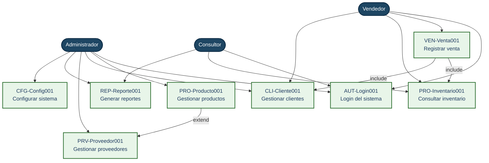

### Diagrama de actividades 1

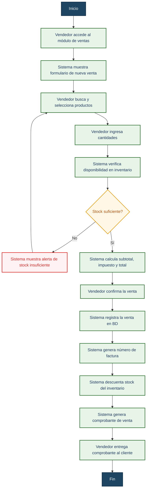

### Diagrama de actividades 2

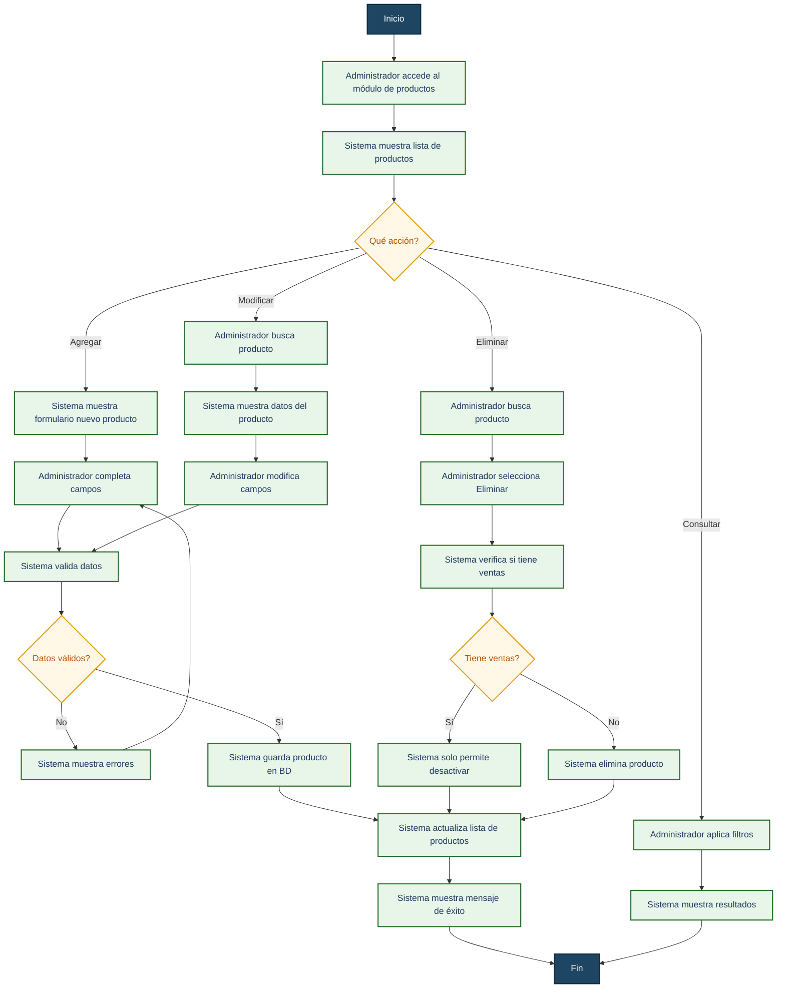

### Diagrama de clases

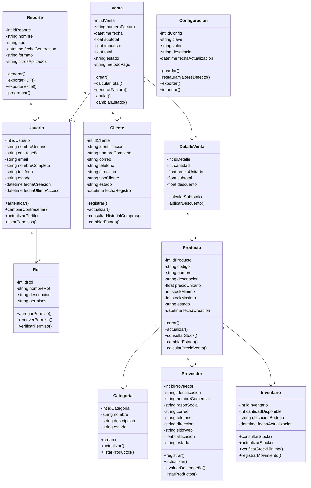
## Prototipo

## 4.1. CONSTRUCCIÓN DE PROTOTIPOS

El prototipo de interfaz fue desarrollado en HTML, CSS y JavaScript, siguiendo los lineamientos visuales definidos en el análisis (paleta institucional, componentes reutilizables y control de acceso por roles). El código fuente completo se encuentra disponible en el repositorio del proyecto y el prototipo navegable puede consultarse en línea.

### 4.1.1. Información del prototipo

| Aspecto | Detalle |
|---|---|
| **Herramienta de construcción** | HTML5, CSS3, JavaScript (Vanilla) |
| **Framework CSS** | MasterCss personalizado |
| **Iconografía** | SVG embebidos (Phosphor Icons) |
| **Notificaciones** | SweetAlert2 |
| **Repositorio** | [Ver repositorio en GitHub](https://github.com/TU_USUARIO/TU_REPO) |
| **Prototipo en línea** | [Ver prototipo navegable en Vercel](https://tu-proyecto.vercel.app) |
| **Credenciales de prueba** | Administrador: `admin / admin123` · Vendedor: `vendedor / venta123` · Consultor: `consultor / consulta123` |

>**Nota:** El prototipo es de baja fidelidad funcional. Los botones y formularios responden visualmente a la interacción del usuario, pero no persisten datos en una base de datos real; están pensados para validar la experiencia de usuario y los flujos de navegación definidos en los casos de uso.

### 4.1.2. Pantallas principales

#### Pantalla 1 — Inicio de sesión

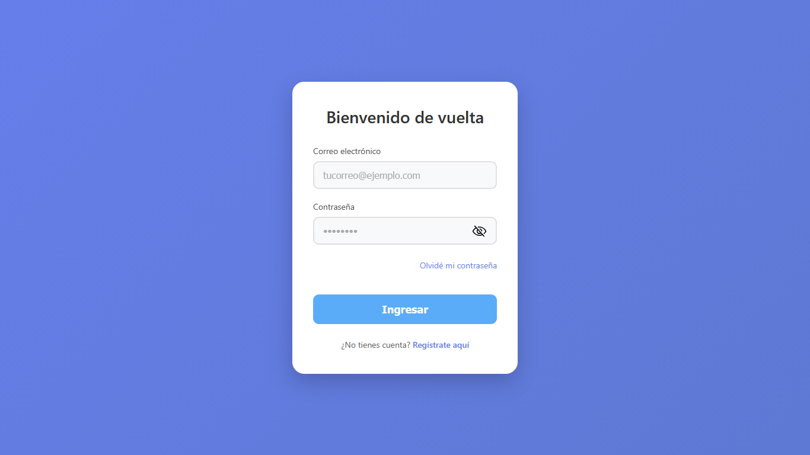

*Formulario de autenticación con validación por roles (Administrador, Vendedor, Consultor). Incluye opciones de recordar contraseña, recuperación y enlace a registro.*

---

#### Pantalla 2 — Panel principal (Dashboard)

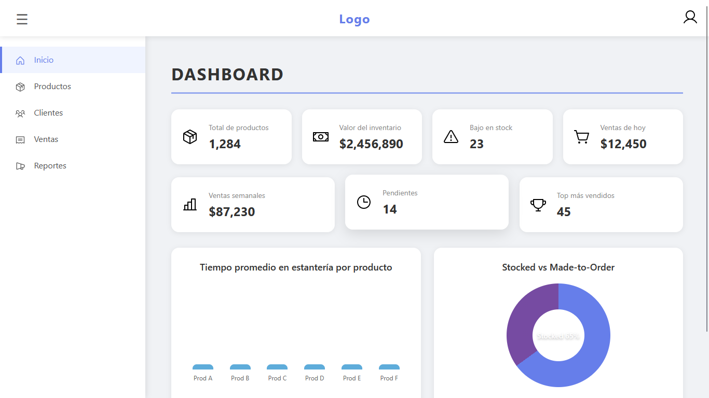

*Panel con KPIs de operación (total de productos, valor del inventario, stock bajo, ventas del día), gráficos de resumen y accesos rápidos a los módulos del sistema.*

---

#### Pantalla 3 — Gestión de productos

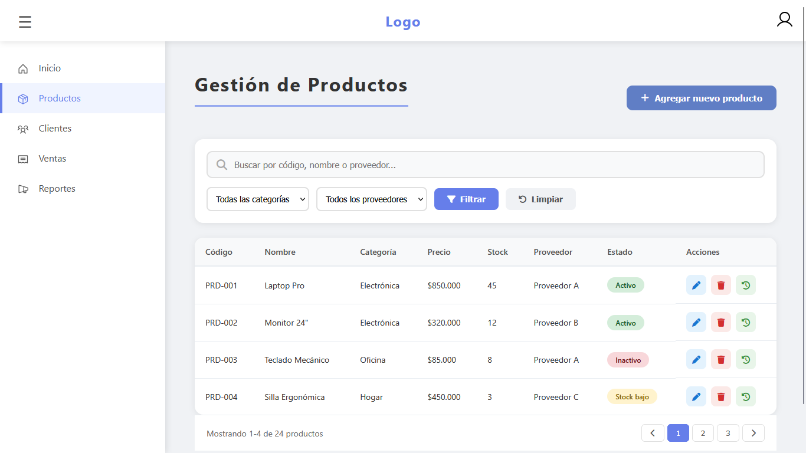

*Módulo de catálogo con búsqueda, filtros, tabla paginada y acciones CRUD (crear, editar, eliminar) sobre los productos del inventario.*

---

#### Pantalla 4 — Gestión de clientes

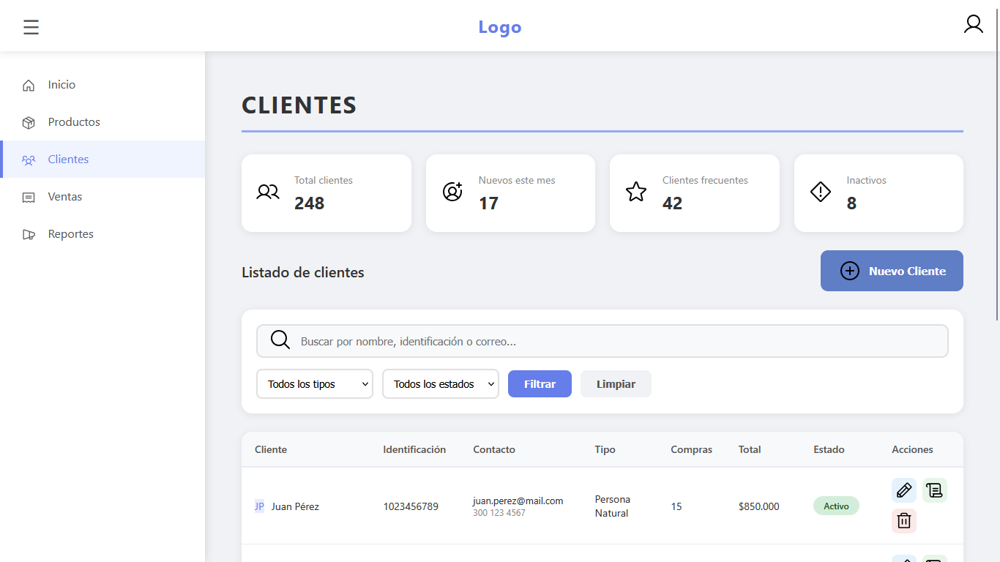

*Administración de clientes (persona natural y jurídica) con datos de contacto, historial de compras, estado (activo/inactivo) y acciones de edición.*

---

#### Pantalla 5 — Registro de ventas

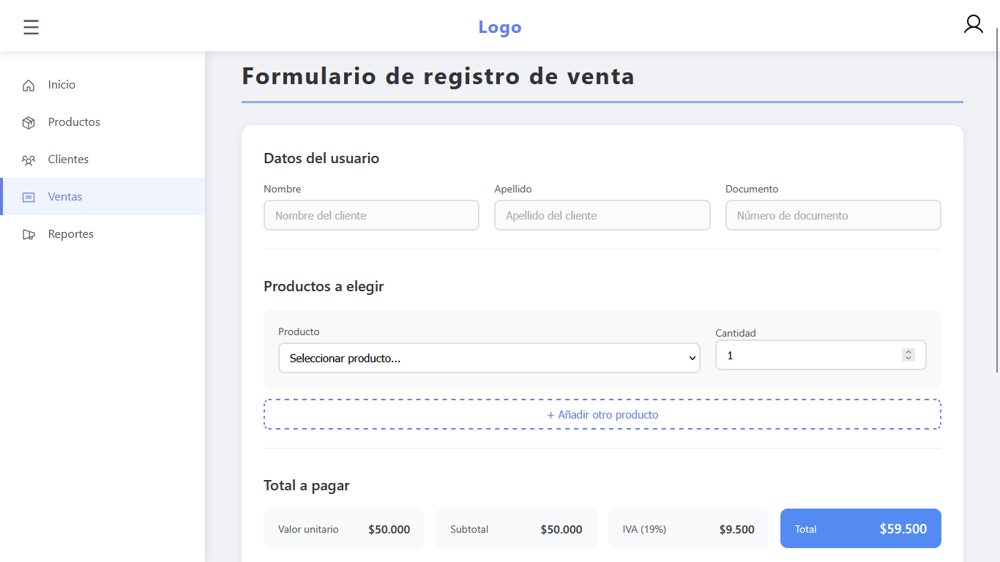

*Formulario de registro de ventas con selección de cliente, productos, cantidades, cálculo automático de subtotal, IVA y total, y generación de comprobante.*

---

#### Pantalla 6 — Generación de reportes

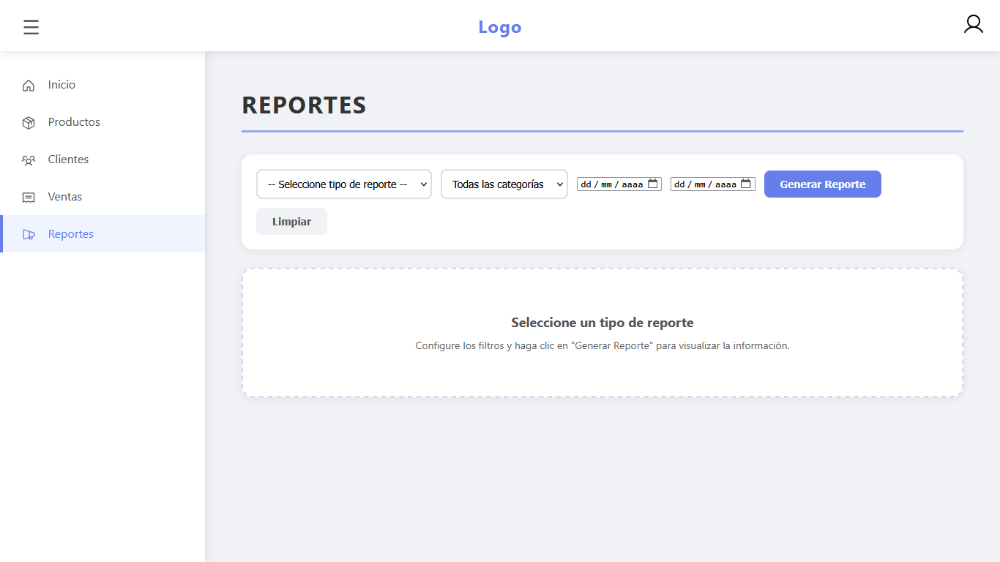

*Módulo de reportes parametrizables por tipo (ventas, inventario, clientes, proveedores), rango de fechas y categorías. Los resultados se muestran en una tabla dinámica y pueden exportarse a PDF o Excel.*

---

#### Pantalla 7 — Cierre de sesión

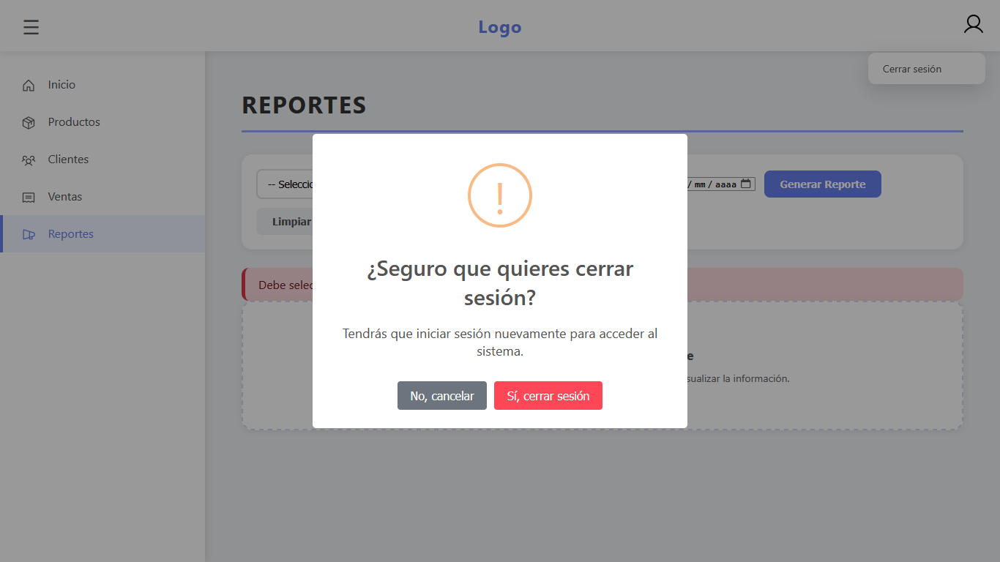

*Confirmación de cierre de sesión con SweetAlert2. Al confirmar, el sistema invalida las credenciales activas y redirige al usuario a la pantalla de inicio de sesión.*

---

### 4.1.3. Verificación del prototipo

| Criterio | Cumple | Observación |
|---|:---:|---|
| Diseño responsive (móvil, tablet, escritorio) | ✅ | Media queries implementadas en MasterCss |
| Coherencia visual entre pantallas | ✅ | Topbar, sidebar y componentes reutilizados |
| Navegación por roles | ✅ | Menús y accesos cambian según el rol autenticado |
| Validación de formularios | ✅ | Campos requeridos, formatos y mensajes de error |
| Retroalimentación al usuario | ✅ | Modales, alertas y notificaciones de confirmación |
| Cobertura de casos de uso | ✅ | 8 casos de uso representados en el prototipo |

### 4.1.4. Enlace de consulta

El prototipo puede explorarse en línea sin necesidad de instalar dependencias:

🔗 **https://prototipo3410390.vercel.app/**

Para revisar el código fuente y la documentación:

🔗 **https://github.com/Jeanks3/Prototipo3410390**
---
## Checklist

## 3. Formulación de Actividades de Aprendizaje

| # | Elemento | Estado | Observación |
|---|----------|--------|-------------|
| 3.1.1 | Situación problemica definida | Completado | Tecnologías del Futuro S.A.S. |
| 3.1.2 | Preguntas clave planteadas | Completado | |
| 3.1.3 | Ambiente requerido identificado | Completado | |
| 3.1.4 | Estrategias didácticas definidas | Completado | |
| 3.1.5 | Materiales de formación listados | Completado | |
| 3.1.6 | Material de apoyo listado | Completado | |

| # | Elemento | Estado | Observación |
|---|----------|--------|-------------|
| 3.2.1 | Descripción de la actividad definida | Completado | |
| 3.2.2 | Técnicas de identificación definidas | Completado | |
| 3.2.3 | Conocimientos previos reconocidos | Completado | |
| 3.2.4 | Ambiente requerido identificado | Completado | |
| 3.2.5 | Estrategias didácticas definidas | Completado | |
| 3.2.6 | Materiales de formación listados | Completado | |
| 3.2.7 | Material de apoyo listado | Completado | |

| # | Elemento | Estado | Observación |
|---|----------|--------|-------------|
| E1.1 | Evaluación de metodologías (RUP, SCRUM, XP) | Completado | |
| E1.2 | Selección justificada de metodología | Completado | |
| E1.3 | Plan de actividades de análisis definido | Completado | |
| E1.4 | Entregables esperados definidos | Completado | |
| E1.5 | Cronograma con fechas estimadas | Completado | |
| E1.6 | Roles y responsabilidades del equipo | Completado | |
| E1.7 | Herramientas a utilizar definidas | Completado | |
| E1.8 | Informe de planeación de análisis elaborado | Completado | |

| # | Elemento | Estado | Observación |
|---|----------|--------|-------------|
| E2.1 | Identificación de actores del sistema | Completado | Administrador, Vendedor, Consultor, Cliente, Proveedor |
| E2.2 | Descripción de roles y responsabilidades | Completado | |
| E2.3 | Identificación de casos de uso | Completado | 8 casos de uso |
| E2.4 | Nombres y descripciones de casos de uso | Completado | |
| E2.5 | Relación actores-casos de uso definida | Completado | |
| E2.6 | Límites del sistema definidos | Completado | |
| E2.7 | Interfaces con otros sistemas identificadas | Completado | |
| E2.8 | Documento de interpretación de requisitos elaborado | Completado | |

| # | Elemento | Estado | Observación |
|---|----------|--------|-------------|
| E3.1 | Herramienta de modelado utilizada | Completado | Mermaid / Draw.io |
| E3.2 | Diagrama de casos de uso UML elaborado | Completado | |
| E3.3 | Relaciones actor-caso de uso representadas | Completado | |
| E3.4 | Relaciones de herencia identificadas | Completado | |
| E3.5 | Relaciones include representadas | Completado | VEN-Venta001 → PRO-Inventario001, CLI-Cliente001 |
| E3.6 | Relaciones extend representadas | Completado | PRO-Producto001 → PRV-Proveedor001 |
| E3.7 | Plantillas extendidas (3 casos de uso) | Completado | Login, Registrar Venta, Gestionar Productos |
| E3.8 | Verificación de cobertura de requisitos | Completado | |

| # | Elemento | Estado | Observación |
|---|----------|--------|-------------|
| E4.1 | Diagrama de actividades - Registrar Venta | Completado | |
| E4.2 | Diagrama de actividades - Actualizar Inventario | Completado | |
| E4.3 | Flujo de trabajo paso a paso detallado | Completado | |
| E4.4 | Decisiones y bifurcaciones representadas | Completado | |
| E4.5 | Actores involucrados identificados | Completado | |
| E4.6 | Objetos de negocio participantes incluidos | Completado | |
| E4.7 | Entidades principales identificadas | Completado | Producto, Venta, Cliente, Proveedor, Inventario |
| E4.8 | Atributos y métodos definidos | Completado | |
| E4.9 | Relaciones y multiplicidades definidas | Completado | |
| E4.10 | Modelo de dominio (diagrama de clases) elaborado | Completado | |
| E4.11 | Consistencia entre modelos verificada | Completado | |

| # | Elemento | Estado | Observación |
|---|----------|--------|-------------|
| E5.1 | Lista de chequeo - Casos de uso | Completado | |
| E5.2 | Lista de chequeo - Actividades | Completado | |
| E5.3 | Lista de chequeo - Modelo de dominio | Completado | |
| E5.4 | Lista de chequeo - Plantillas | Completado | |
| E5.5 | Listas de chequeo aplicadas | Completado | |
| E5.6 | Hallazgos y mejoras documentados | Completado | |
| E5.7 | Prototipo inicial (baja fidelidad) elaborado | Completado | |
| E5.8 | Pantallas principales representadas | Completado | Login, Panel Vendedor, Registrar Venta, Panel Admin |
| E5.9 | Navegación entre pantallas definida | Completado | |
| E5.10 | Interacción con actores representada | Completado | |
| E5.11 | Informe de verificación generado | Completado | |
| E5.12 | Modelos ajustados según hallazgos | Completado | |

| # | Elemento | Estado | Observación |
|---|----------|--------|-------------|
| 3.4.1 | Selección del proyecto | Completado | Proyecto formativo SENA |
| 3.4.2 | Planeación del análisis definida | Completado | |
| 3.4.3 | Interpretación de requisitos realizada | Completado | |
| 3.4.4 | Diagrama de casos de uso elaborado | Completado | |
| 3.4.5 | Diagramas de actividades elaborados | Completado | |
| 3.4.6 | Modelo de dominio elaborado | Completado | |
| 3.4.7 | Listas de chequeo aplicadas | Pendiente | |
| 3.4.8 | Mejoras realizadas a los modelos | Pendiente | |
| 3.4.9 | Prototipo inicial elaborado | Pendiente | |
| 3.4.10 | Informe de análisis completo | Pendiente | |

---

## Resumen de avance

| Categoría | Completado | Pendiente | % Avance |
|-----------|------------|-----------|----------|
| 3.1 Reflexión Inicial | 6/6 | 0 | 100% |
| 3.2 Contextualización | 7/7 | 0 | 100% |
| 3.3 Ejercicio 1 | 8/8 | 0 | 100% |
| 3.3 Ejercicio 2 | 8/8 | 0 | 100% |
| 3.3 Ejercicio 3 | 8/8 | 0 | 100% |
| 3.3 Ejercicio 4 | 11/11 | 0 | 100% |
| 3.3 Ejercicio 5 | 12/12 | 0 | 100% |
| 3.4 Transferencia | 6/10 | 4 | 60% |
| **Total** | **66/70** | **4** | **94%** |

---

## Observaciones finales

- Ejercicios de apropiación (1 al 5) completados exitosamente.
- Modelos generados son consistentes entre sí.
- **Pendientes:** Listas de chequeo aplicadas (3.4.7), Mejoras a modelos (3.4.8), Prototipo inicial (3.4.9) e Informe de análisis completo (3.4.10).

---

## 4.2. FORMATO DE CASO DE PRUEBA

## FORMATO DE CASOS DE PRUEBA

| CAMPO | INFORMACIÓN |
|---|---|
| **OBJETIVO DEL CASO DE PRUEBA** | |
| **IDENTIFICADOR** | |
| **NOMBRE DEL REQUERIMIENTO** | |
| **PRECONDICIONES** | |

| PASOS | RESULTADOS ESPERADOS |
|---|---|
| 1. | 1. |
| 2. | 2. |
| 3. | 3. |

---

# 4.3. CRONOGRAMA DE ACTIVIDADES

### CRONOGRAMA DE ANÁLISIS - TECNOLOGÍAS DEL FUTURO S.A.S.

El siguiente cronograma detalla las actividades planificadas para la fase de análisis del proyecto, estableciendo tiempos, responsables y entregables clave.

---

#### **Tabla de actividades**

| Actividad | Tiempo | Mes 1 |  |  |  | Mes 2 |  |  |  | Mes 3 |  |  |  | Mes 4 |  |  |  |
|---|---|---|---|---|---|---|---|---|---|---|---|---|---|---|---|---|---|
|  |  | **S1** | **S2** | **S3** | **S4** | **S5** | **S6** | **S7** | **S8** | **S9** | **S10** | **S11** | **S12** | **S13** | **S14** | **S15** | **S16** |
| **1. Evaluación metodologías** | S1-S3 (3 sem) | 🟥 | 🟥 | 🟥 |  |  |  |  |  |  |  |  |  |  |  |  |  |
| **2. Selección y justificación** | S2-S4 (3 sem) |  | 🟧 | 🟧 | 🟧 |  |  |  |  |  |  |  |  |  |  |  |  |
| **3. Definición roles y herramientas** | S3-S5 (3 sem) |  |  | 🟩 | 🟩 | 🟩 |  |  |  |  |  |  |  |  |  |  |  |
| **4. Levantamiento de requisitos** | S5-S9 (5 sem) |  |  |  |  | 🟥 | 🟥 | 🟥 | 🟥 | 🟥 |  |  |  |  |  |  |  |
| **5. Diseño arquitectura y modelo datos** | S8-S11 (4 sem) |  |  |  |  |  |  |  | 🟧 | 🟧 | 🟧 | 🟧 |  |  |  |  |  |
| **6. Modelado UML y prototipos UI/UX** | S10-S13 (4 sem) |  |  |  |  |  |  |  |  |  | 🟥 | 🟥 | 🟥 | 🟥 |  |  |  |
| **7. Documentación de planeación** | S12-S14 (3 sem) |  |  |  |  |  |  |  |  |  |  |  | 🟩 | 🟩 | 🟩 |  |  |
| **8. Revisión, auditoría y entrega final** | S14-S16 (3 sem) |  |  |  |  |  |  |  |  |  |  |  |  |  | 🟥 | 🟥 | 🟥 |

**Leyenda de colores:**  
🟥 = Crítica  
🟧 = Alta  
🟩 = Media  
(las celdas vacías indican que no hay actividad en esa semana)

---

#### **Hitos (entregables)**

| Hito | Entregable | Semana de entrega |
|---|---|---|
| **🔹 HITO 1** | Informe de Planeación y Alcance | **S2** |
| **🔹 HITO 2** | Casos de Uso + Plantillas extendidas | **S6** |
| **🔹 HITO 3** | Diagramas de Actividades + Modelo de Dominio | **S10** |
| **🔹 HITO 4** | Prototipo Navegable + Informe Final de Análisis | **S15** |

---

#### **Resumen del cronograma**

- **Duración total:** 16 semanas (4 meses)  
- **Fecha de inicio:** 2 de septiembre de 2024  
- **Fecha de finalización:** 20 de diciembre de 2024  
- **Entregas mensuales:** Al finalizar cada mes  
- **Equipo:** 1 Líder Técnico, 2 Analistas, 6 Desarrolladores  
- **Total de actividades:** 8 principales + 4 hitos